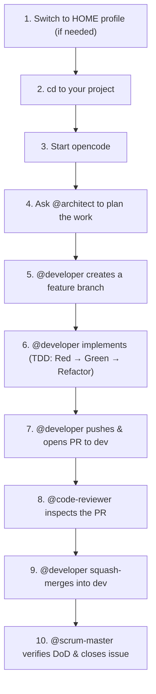

# Admin and User Guide — OpenCode HOME Configuration

> **Version:** v1.2.0 | **Date:** 2026-09-07 | **Author:** `@architect` (HOME SCRUM Squad)

---

## Table of Contents

1. [What is OpenCode?](#1-what-is-opencode)
2. [Admin Guide](#2-admin-guide)
   - [Prerequisites](#21-prerequisites)
   - [Installation](#22-installation)
   - [Secrets Management](#23-secrets-management)
   - [Directory Structure](#24-directory-structure)
   - [3-Branch Git Lifecycle](#25-3-branch-git-lifecycle)
   - [MCP Containers](#26-mcp-containers)
   - [CI/CD Pipeline](#27-cicd-pipeline)
   - [Troubleshooting](#28-troubleshooting)
3. [User Guide](#3-user-guide)
   - [Starting a Session](#31-starting-a-session)
   - [Agents](#32-agents)
   - [Skills](#33-skills)
   - [MCP Tools](#34-mcp-tools)
   - [Models](#35-models)
   - [Daily Workflow](#36-daily-workflow)
   - [Dos and Donts](#37-dos-and-donts)
4. [Switching Between HOME and WORK Profiles](#4-switching-between-home-and-work-profiles)
   - [How Profile Switching Works](#41-how-profile-switching-works)
   - [Switch to HOME Profile](#42-switch-to-home-profile)
   - [Switch to WORK Profile](#43-switch-to-work-profile)
   - [Verify Active Profile](#44-verify-active-profile)
   - [Project-Level Overrides (Deep-Merge Shielding)](#45-project-level-overrides-deep-merge-shielding)
   - [Warnings](#46-warnings)

---

## 1. What is OpenCode?

OpenCode is an AI-powered coding assistant that runs on your workstation. It uses **agents** (specialized AI personas like an architect, developer, or coach), **skills** (domain-specific knowledge modules), and **MCP tools** (external service connectors like GitHub and Intervals.icu) to help you work on projects. OpenCode reads a configuration file (`opencode.jsonc`) that defines which AI models to use, which agents and skills are available, and which external tools are connected.

You run OpenCode by navigating to a project directory and typing `opencode`. The agents then help you plan, code, review, and manage your work — all from your terminal.

---

## 2. Admin Guide

This section is for the person who sets up and maintains the OpenCode environment on a workstation (e.g., VIDAR).

### 2.1 Prerequisites

| Requirement | Details |
|:---|:---|
| **OS** | Linux (tested on Ubuntu/Debian) |
| **Shell** | `bash` (for `~/.bashrc` + `~/.profile` sourcing) |
| **Docker** | Installed and running (for MCP containers) |
| **OpenCode CLI** | Installed at `~/.opencode/bin/opencode` (v1.18.29+) |
| **Git** | Installed and configured with SSH keys for GitHub |
| **GitHub account** | With access to `fpittelo/opencode-home-config` |

### 2.2 Installation

```bash
# 1. Clone the config repo
git clone git@github.com:fpittelo/opencode-home-config.git ~/projects/opencode-home-config

# 2. Run the installer
cd ~/projects/opencode-home-config
chmod +x install.sh && ./install.sh
```

**What `install.sh` does:**

| Step | Action | Target |
|:---|:---|:---|
| 1 | Symlink the config file | `~/.config/opencode/opencode.jsonc` → repo's `opencode.jsonc` |
| 1 | Symlink the agents directory | `~/.config/opencode/agents` → repo's `agents/` |
| 1 | Symlink the skills directory | `~/.config/opencode/skills` → repo's `skills/` |
| 2 | Create secrets template (if absent) | `~/.config/opencode/.secrets.env` (chmod 600) |
| 3 | Add sourcing to `~/.bashrc` | Sources `.secrets.env` in new terminal sessions |
| 3 | Add sourcing to `~/.profile` | Sources `.secrets.env` in login shells |
| 3 | Import to systemd user session | `systemctl --user import-environment` (for GUI apps) |

The installer is **idempotent** — running it again will update the symlinks but will NOT overwrite an existing `.secrets.env`.

### 2.3 Secrets Management

The secrets file lives at `~/.config/opencode/.secrets.env` (never committed to Git, chmod 600).

**Required environment variables (HOME profile):**

| Variable | Purpose | Where to get it |
|:---|:---|:---|
| `OPENROUTER_HOME_API_KEY` | OpenRouter API access (all AI models) | https://openrouter.ai/keys |
| `GITHUB_PERSONAL_ACCESS_TOKEN` | GitHub MCP server (issues, PRs, releases) | https://github.com/settings/tokens (fine-grained, read/write) |
| `INTERVALS_API_KEY` | Intervals.icu API (coach MCP — workout data) | https://intervals.icu/api/v1/auth |
| `INTERVALS_ATHLETE_ID` | Intervals.icu athlete ID (coach MCP) | https://intervals.icu/athlete (numeric ID in URL) |

**To populate secrets:**

```bash
# Edit the file (created by install.sh)
nano ~/.config/opencode/.secrets.env

# Fill in your keys (replace the <...> placeholders):
# export OPENROUTER_HOME_API_KEY="<your-openrouter-key>"
# export GITHUB_PERSONAL_ACCESS_TOKEN="<your-github-token>"
# export INTERVALS_API_KEY="<your-intervals-key>"
# export INTERVALS_ATHLETE_ID="<your-athlete-id>"

# Verify permissions
ls -la ~/.config/opencode/.secrets.env
# Should show: -rw------- ... .secrets.env

# Reload in current session
source ~/.config/opencode/.secrets.env

# Verify all 4 keys are populated (without printing values)
for v in OPENROUTER_HOME_API_KEY GITHUB_PERSONAL_ACCESS_TOKEN INTERVALS_API_KEY INTERVALS_ATHLETE_ID; do
    echo "$v: $([ -n "${!v}" ] && echo 'OK' || echo 'EMPTY')"
done
```

> **Security:** Never print secret values. Never commit `.secrets.env`. The `.gitignore` already excludes it. Gitleaks scans every push in CI.

### 2.4 Directory Structure

The recommended directory layout on VIDAR:

```
~/projects/
├── opencode-home-config/     ← HOME config repo (this repo, global default)
├── opencode-work-config/      ← WORK config repo (GitLab, for EPFL projects)
├── HOME/                      ← personal projects (HOME profile)
│   └── my-personal-project/
└── WORK/                      ← EPFL work projects (WORK profile)
    └── my-epfl-service/
```

- **Config repos** (`opencode-home-config/`, `opencode-work-config/`) live directly under `~/projects/` — they are tooling, not workspaces.
- **Project directories** (`HOME/`, `WORK/`) group projects by context.

### 2.5 3-Branch Git Lifecycle

All work follows a strict 3-branch lifecycle:

```
dev (integration) → qa (staging) → main (production)
```

| Branch | Purpose | Who can merge into it? |
|:---|:---|:---|
| `dev` | Integration — all feature branches merge here | Any squad member via PR |
| `qa` | Staging — promoted from `dev` with @fpittelo approval | @architect (with explicit approval) |
| `main` | Production — promoted from `qa` with @fpittelo approval | @architect (with explicit approval) |

**Feature branches** are created from `dev`:

```
feature/<issue-#>-<slug>    # New features
fix/<issue-#>-<slug>        # Bug fixes
```

**Rules:**
- Never commit directly to `dev`, `qa`, or `main` — always use a feature branch + PR.
- Feature branches can ONLY merge into `dev` — never directly into `qa` or `main`.
- Every merge requires a 100% clean CI pipeline (0 warnings, 0 failures).
- `dev` → `qa` and `qa` → `main` promotions require **explicit approval from @fpittelo**.
- Merging to `main` creates a versioned release tag (`vX.Y.Z`) and triggers board hygiene.

### 2.6 MCP Containers

OpenCode connects to external services via **MCP (Model Context Protocol) servers** running as Docker containers. The HOME profile defines 4 containers:

| MCP Server | Docker Image | Environment Variables | Purpose |
|:---|:---|:---|:---|
| `GITHUB` | `ghcr.io/github/github-mcp-server:latest` | `GITHUB_PERSONAL_ACCESS_TOKEN` | GitHub issues, PRs, releases, branches |
| `COACH DEV` | `ghcr.io/fpittelo/coach:dev` | `INTERVALS_API_KEY`, `INTERVALS_ATHLETE_ID` | Training plans (dev branch of coach service) |
| `COACH QA` | `ghcr.io/fpittelo/coach:qa` | `INTERVALS_API_KEY`, `INTERVALS_ATHLETE_ID` | Training plans (qa staging) |
| `COACH MAIN` | `ghcr.io/fpittelo/coach:latest` | `INTERVALS_API_KEY`, `INTERVALS_ATHLETE_ID` | Training plans (production) |

All 4 containers are pre-flighted and verified working (see Issue #24 — Derisk #2).

**How they work:**
- OpenCode starts each container with `docker run -i --rm` and communicates via stdin/stdout (stdio transport).
- Environment variables are injected from `~/.config/opencode/.secrets.env` via `{env:VAR}` interpolation.
- Containers are automatically removed (`--rm`) when the session ends.

### 2.7 CI/CD Pipeline

The GitHub Actions CI pipeline (`.github/workflows/ci.yml`) runs on every push and PR to `dev`:

| Check | What it does | Failure condition |
|:---|:---|:---|
| **JSONC validation** | Strips `//` comments and parses `opencode.jsonc` as valid JSON | Malformed JSONC |
| **Gitleaks scan** | Runs `zricethezav/gitleaks:latest detect` on the full repo | Any hardcoded secret detected |

**Quality gate:** The pipeline must pass with **zero warnings and zero failures** before any merge.

### 2.8 Troubleshooting

| Symptom | Likely Cause | Fix |
|:---|:---|:---|
| `opencode` fails to start | `OPENROUTER_HOME_API_KEY` empty | `source ~/.config/opencode/.secrets.env` |
| MCP tools not available | Docker not running | `systemctl --user start docker` or `sudo systemctl start docker` |
| MCP container pull fails | Network or GHCR auth issue | `docker pull ghcr.io/github/github-mcp-server:latest` to test |
| Agents not loading | Broken symlink in `~/.config/opencode/agents` | Re-run `install.sh` |
| Skills not activating | Broken symlink in `~/.config/opencode/skills` | Re-run `install.sh` |
| Wrong model used | `opencode.jsonc` has wrong `model` field | Check `opencode.jsonc` line 3 |
| `.secrets.env` not sourced | `~/.bashrc` or `~/.profile` missing the source line | Re-run `install.sh` (step 3 adds it) |
| Secrets not in GUI apps | systemd user session doesn't have them | `systemctl --user import-environment OPENROUTER_HOME_API_KEY ...` |

---

## 3. User Guide

This section is for anyone who uses OpenCode day-to-day. No deep technical knowledge required.

### 3.1 Starting a Session

```bash
# Navigate to your project
cd ~/projects/HOME/my-personal-project

# Start OpenCode
opencode
```

That's it. OpenCode loads the HOME profile (agents, skills, MCP tools, and models) and starts an interactive session.

### 3.2 Agents

Agents are AI personas with specific roles, permissions, and model assignments. The HOME profile has 7 agents:

| Agent | Role | Model | Can edit files? | Can run bash? |
|:---|:---|:---|:---|:---|
| **@architect** | Technical Lead & Solution Architect — designs systems, writes specs, grooms backlog | GLM 5.2 | Yes | Yes |
| **@coach** | Athletic Coach & Longevity Advisor — Zwift cycling, kettlebell, Intervals.icu analytics | Gemini 3.7 Flash | No | No |
| **@code-reviewer** | PR Quality Gatekeeper — inspects pull requests and approves/rejects | GLM 5.2 | No | No |
| **@cyber-security** | Security Specialist — threat modeling, secret scanning, vulnerability auditing | Kimi K2.7 Code | No | No |
| **@developer** | Senior Developer — Rust + Python dual-stack, strict TDD, writes production code | Kimi K2.7 Code | Yes | Yes |
| **@devops** | DevOps Engineer — CI/CD pipelines, Docker, release automation, infrastructure | Kimi K2.7 Code | Yes | Yes |
| **@scrum-master** | Scrum Master — sprint facilitation, DoD enforcement, board hygiene | GLM 5.2 | No | No |

**How agents work:**
- **Primary agents** (architect, coach) are available directly in the main session.
- **Subagents** (code-reviewer, cyber-security, developer, devops, scrum-master) are dispatched by the primary agent when their specialty is needed.
- Each agent has a **temperature** setting (0.1–0.3) — lower means more deterministic, higher means more creative.

### 3.3 Skills

Skills are knowledge modules that activate automatically when the conversation matches their domain. The HOME profile has 10 skills:

| Skill | What it does | When it activates |
|:---|:---|:---|
| **coach** | Endurance training, Zwift cycling, kettlebell, Intervals.icu analytics | Athletic coaching questions, workout planning |
| **docker-expert** | Docker containerization, multi-stage builds, security hardening | Container/Docker questions |
| **fastmcp-builder** | Designing FastMCP servers, Pydantic v2 schemas, transport protocols | Building MCP tools |
| **find-skills** | Discovers and installs new skills from the ecosystem | "How do I do X?" or "Find a skill for X" |
| **github-scrum-board** | Sprint management, issue templates, DoD enforcement | GitHub issue/PR/milestone management |
| **home-governance** | HOME portfolio context, Swiss privacy rules, Git lifecycle, SCRUM governance | Session start, design inception |
| **mermaid-diagrams** | Creating diagrams (C4, sequence, ERD, flowcharts) using Mermaid syntax | "Diagram", "visualize", "model", architecture diagrams |
| **opentofu-iac** | Infrastructure as Code (OpenTofu/Terraform) for GCP/Azure | Cloud infrastructure, IaC questions |
| **release-automation** | Semantic versioning, promotion gates, post-release board hygiene | Release coordination, `dev` → `qa` → `main` |
| **test-driven-development** | TDD workflow (Red → Green → Refactor) | Writing or modifying implementation code |

**How skills activate:** Skills load automatically when the conversation topic matches their description. You don't need to do anything — just ask a question and the relevant skill provides context to the agent.

### 3.4 MCP Tools

MCP tools connect OpenCode to external services. The HOME profile has 4 MCP containers:

| MCP Tool | What it provides |
|:---|:---|
| **GITHUB** | Create/read GitHub issues, PRs, releases, branches, commits. The agent you're talking to right now uses this. |
| **COACH DEV** | Training plan management (dev branch of coach service — experimental) |
| **COACH QA** | Training plan management (qa staging — pre-production) |
| **COACH MAIN** | Training plan management (production coach service) |

The coach containers connect to Intervals.icu for workout analytics, training plans, and athlete data.

### 3.5 Models

The HOME profile uses **OpenRouter only** — no direct Google or Anthropic API keys needed. All models are accessed through a single OpenRouter API key.

**Configured models:**

| Model ID | Display Name | Role |
|:---|:---|:---|
| `moonshotai/kimi-k2.7-code` | Kimi K2.7 Code | **Default model** (main session) |
| `google/gemini-3.7-flash` | Gemini 3.7 Flash | **Small model** (fast/cheap tasks) |
| `google/gemini-3.8-flash` | Gemini 3.8 Flash | Available for selection |
| `moonshotai/kimi-k2.6` | Kimi K2.6 | Available for selection |
| `z-ai/glm-5.2` | GLM 5.2 | Available for selection (used by @architect, @code-reviewer, @scrum-master) |
| `z-ai/glm-5.3-flash` | GLM 5.3 Flash | Available for selection |

**How to change the default model:** Edit line 3 of `opencode.jsonc`:
```jsonc
"model": "openrouter/moonshotai/kimi-k2.7-code",
```

### 3.6 Daily Workflow

Here's a simple step-by-step for working on a project:



**Step-by-step:**

1. **Switch to the HOME profile** (if you were in WORK mode):
   ```bash
   ln -sf ~/projects/opencode-home-config/opencode.jsonc ~/.config/opencode/opencode.jsonc
   ```

2. **Navigate to your project:**
   ```bash
   cd ~/projects/HOME/my-personal-project
   ```

3. **Start OpenCode:**
   ```bash
   opencode
   ```

4. **Ask @architect to plan the work:** Describe what you want to build. The architect will create or groom GitHub issues, define acceptance criteria, and assign work to the right agents.

5. **@developer creates a feature branch:** The developer branches off `dev` with `feature/<issue-#>-<slug>`.

6. **@developer implements using TDD:** Red (write failing test) → Green (make it pass) → Refactor (clean up).

7. **@developer pushes and opens a PR to `dev`:** The PR description references the issue (`Resolves #<issue-#>`).

8. **@code-reviewer inspects the PR:** Read-only inspection, formal APPROVE or REQUEST_CHANGES.

9. **@developer squash-merges into `dev`:** CI must be 100% clean (0 warnings, 0 failures).

10. **@scrum-master verifies DoD and closes the issue:** The Definition of Done is checked and the issue is closed.

### 3.7 Dos and Donts

| Do | Don't |
|:---|:---|
| ✅ Use feature branches (`feature/<issue-#>-<slug>`) | ❌ Commit directly to `dev`, `qa`, or `main` |
| ✅ Reference the issue in your PR (`Resolves #<issue-#>`) | ❌ Open a PR without an issue |
| ✅ Run `install.sh` after cloning the repo | ❌ Manually edit symlinks (use `install.sh`) |
| ✅ Keep `.secrets.env` at chmod 600 | ❌ Share or print secret values |
| ✅ Verify CI is green before merging | ❌ Merge a PR with failing CI |
| ✅ Use OpenRouter for all AI models (HOME profile) | ❌ Add direct Google/Anthropic API keys |
| ✅ Ask @architect to plan before @developer codes | ❌ Jump straight to coding without a plan |
| ✅ Restart opencode after switching profiles | ❌ Keep an old session running with a stale profile |

---

## 4. Switching Between HOME and WORK Profiles

The OpenCode configuration supports **two profiles**: HOME (personal projects, this repo) and WORK (EPFL projects, GitLab repo). Only one profile is active at a time.

### 4.1 How Profile Switching Works

The active profile is determined by a **single symlink**:

```
~/.config/opencode/opencode.jsonc → <repo>/opencode.jsonc
```

| If the symlink points to... | Active profile | Use case |
|:---|:---|:---|
| `~/projects/opencode-home-config/opencode.jsonc` | **HOME** | Personal projects under `~/projects/HOME/` |
| `~/projects/opencode-work-config/opencode.jsonc` | **WORK** | EPFL projects under `~/projects/WORK/` |

The symlink also controls the `agents/` and `skills/` directories (via separate symlinks created by `install.sh`). Each profile has its own agents, skills, models, and MCP configuration.

**Profile comparison:**

| Feature | HOME | WORK |
|:---|:---|:---|
| **Repo** | `fpittelo/opencode-home-config` (GitHub) | `isgov/ea/opencode-work-config` (GitLab) |
| **Agents** | 7 | 8 |
| **Skills** | 10 | 20 |
| **MCP: GITHUB** | ✅ Enabled | ❌ Disabled (deep-merge shielding) |
| **MCP: COACH** | ✅ Enabled | ❌ Disabled (deep-merge shielding) |
| **AI providers** | OpenRouter only | EPFL AI + OpenRouter |
| **Default model** | `kimi-k2.7-code` (via OpenRouter) | EPFL AI default |
| **Directory** | `~/projects/HOME/` | `~/projects/WORK/` |

### 4.2 Switch to HOME Profile

Run this command to switch to the HOME profile:

```bash
ln -sf ~/projects/opencode-home-config/opencode.jsonc ~/.config/opencode/opencode.jsonc
ln -sfn ~/projects/opencode-home-config/agents ~/.config/opencode/agents
ln -sfn ~/projects/opencode-home-config/skills ~/.config/opencode/skills
```

Or simply re-run the HOME installer (it does all three symlinks):

```bash
cd ~/projects/opencode-home-config && ./install.sh
```

**After switching to HOME:**
- **7 agents** available (architect, coach, code-reviewer, cyber-security, developer, devops, scrum-master)
- **10 skills** available (coach, docker-expert, fastmcp-builder, find-skills, github-scrum-board, home-governance, mermaid-diagrams, opentofu-iac, release-automation, test-driven-development)
- **4 MCP containers** active (GITHUB, COACH DEV, COACH QA, COACH MAIN)
- **OpenRouter only** — all AI models via `OPENROUTER_HOME_API_KEY`
- **Use for:** personal projects under `~/projects/HOME/`

### 4.3 Switch to WORK Profile

Run this command to switch to the WORK profile:

```bash
ln -sf ~/projects/opencode-work-config/opencode.jsonc ~/.config/opencode/opencode.jsonc
ln -sfn ~/projects/opencode-work-config/agents ~/.config/opencode/agents
ln -sfn ~/projects/opencode-work-config/skills ~/.config/opencode/skills
```

Or re-run the WORK installer:

```bash
cd ~/projects/opencode-work-config && ./install.sh
```

**After switching to WORK:**
- **8 agents** available (includes EPFL-specific agents)
- **20 skills** available (includes all HOME skills + EPFL-specific skills)
- **GITHUB + COACH MCPs are disabled** (deep-merge shielding sets `"enabled": false`)
- **EPFL AI + OpenRouter** — EPFL AI as default, OpenRouter as fallback
- **Use for:** EPFL projects under `~/projects/WORK/`

### 4.4 Verify Active Profile

To check which profile is currently active:

```bash
ls -la ~/.config/opencode/opencode.jsonc
```

**Output examples:**

| Output | Active profile |
|:---|:---|
| `→ ~/projects/opencode-home-config/opencode.jsonc` | HOME |
| `→ ~/projects/opencode-work-config/opencode.jsonc` | WORK |

You can also check the agents and skills directories:

```bash
ls -la ~/.config/opencode/agents   # Shows symlink target
ls -la ~/.config/opencode/skills   # Shows symlink target
```

### 4.5 Project-Level Overrides (Deep-Merge Shielding)

OpenCode supports **project-level configuration overrides**. A project directory can contain its own `.opencode/opencode.jsonc` that is deep-merged with the global config.

**How it works in WORK mode:**

The WORK `opencode.jsonc` sets the `GITHUB` and `COACH *` MCP servers to `"enabled": false`:

```jsonc
"mcp": {
    "GITHUB": { ..., "enabled": false },
    "COACH DEV": { ..., "enabled": false },
    ...
}
```

This means even if a project under `~/projects/WORK/` somehow had access to the HOME config, the WORK config would suppress personal MCP tools in EPFL project directories. This **deep-merge shielding** prevents personal tools from leaking into the EPFL workspace.

**Practical effect:**
- In `~/projects/HOME/` → HOME profile active → GITHUB + COACH MCPs work
- In `~/projects/WORK/` → WORK profile active → GITHUB + COACH MCPs suppressed
- A project-level `.opencode/opencode.jsonc` under `~/projects/WORK/my-epfl-project/` can further override settings per-project

### 4.6 Warnings

| Warning | Why |
|:---|:---|
| ⚠️ **Do NOT mix profiles** | Running the HOME profile while working in `~/projects/WORK/` could expose personal MCP tools (GITHUB, COACH) in an EPFL context. Always switch to WORK before working on EPFL projects. |
| ⚠️ **Restart opencode after switching** | OpenCode loads the config at session start. If you switch profiles, you must restart `opencode` (quit and relaunch) to pick up the new config. |
| ⚠️ **Secrets are shared** | Both profiles use the same `~/.config/opencode/.secrets.env` file. The API keys don't change — only the config (agents, skills, MCPs, models) changes. |
| ⚠️ **Don't edit the symlink directly** | Use `install.sh` or the `ln -sf` commands above. Manually editing the symlink can break the path. |

---

## Further Reading

| Resource | Location | Description |
|:---|:---|:---|
| Migration Plan v3.1 | `docs/opencode-config-migration-plan-v3.1.md` | Full migration plan from Google Drive to Git-tracked repos |
| README | `README.md` | Quick-start and repository structure |
| WORK Guide | GitLab `isgov/ea/opencode-work-config` → `docs/Admin-and-User-Guide.md` | Admin and User Guide for the WORK (EPFL) profile |

---

**Architecture:** Golden Architecture v3.1  
**Author:** `@architect` (HOME SCRUM Squad)  
**Repository:** `fpittelo/opencode-home-config` (GitHub)  
**License:** Personal — Frederic Pitteloud (@fpittelo)
