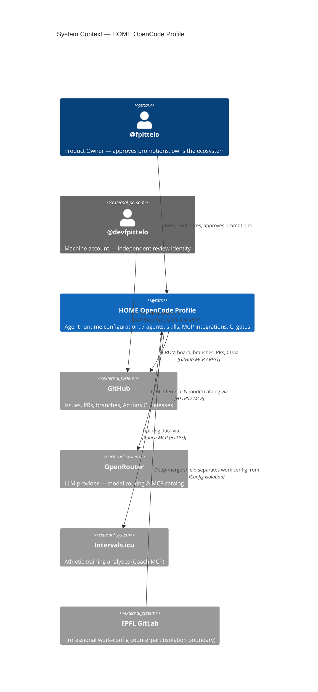

# 3. System Context & Scope

*Status: seeded (Sprint 03, STORY-02 #59).*

## 3.1 Business Context

**Narrative:** the profile is operated by @fpittelo. Agents act on GitHub (delivery backbone) and OpenRouter (LLM routing) under scoped permissions. The Coach MCP connects to Intervals.icu for the athletic domain. The EPFL GitLab relationship is an *isolation* relationship: the work profile must never read or merge HOME data (strict boundary separation, `home-governance` §2).

## 3.2 Technical Context

| Channel | Protocol | Notes |
| :--- | :--- | :--- |
| GitHub MCP servers (`GITHUB`, `GITHUB_CODE_REVIEWER`) | stdio → native binary (pinned v1.12.2, SHA256-verified by `install.sh`) | Personal-access-token authenticated; SoD split per #68. |
| Coach MCP servers (`COACH_DEV/QA/MAIN`) | stdio → Docker container | Environment-scoped (dev/qa/main) Intervals.icu access. |
| OpenRouter MCP (`openrouter`) | remote streamable-HTTP | OAuth handled by OpenCode on first use; no stored token. |
| LLM inference | HTTPS (OpenRouter API) | Model per agent via `openrouter/<model>` assignments. |
| CI | GitHub Actions | JSONC validation + Gitleaks full-history scan. |

## 3.3 Scope Decisions

- **In scope:** agent definitions, permission model, MCP server wiring, skills library, install script, CI pipeline, SCRUM board automation, architecture documentation.
- **Out of scope:** the OpenCode runtime itself (upstream product), MCP server implementations (separate repos, e.g. coach), EPFL work configuration (`opencode-work-config`), cloud infrastructure repos (`iaac-*`).