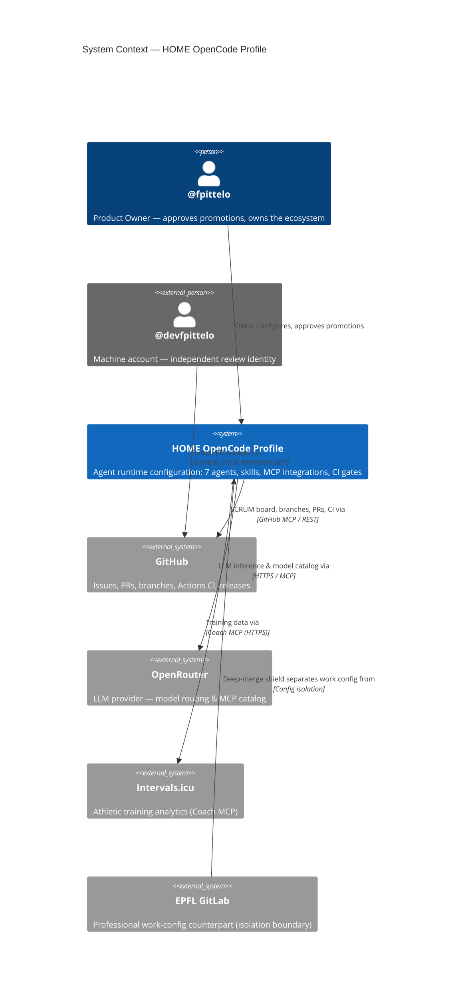

# 3. System Context & Scope

*Status: seeded (Sprint 03, STORY-02 #59).*

## 3.1 Business Context

```mermaid
C4Context
    title System Context — HOME OpenCode Profile

    Person(fpittelo, "@fpittelo", "Product Owner — approves promotions, owns the ecosystem")
    Person_Ext(devfpittelo, "@devfpittelo", "Machine account — independent review identity")

    System(homeprofile, "HOME OpenCode Profile", "Agent runtime configuration: 7 agents, skills, MCP integrations, CI gates")

    System_Ext(github, "GitHub", "Issues, PRs, branches, Actions CI, releases")
    System_Ext(openrouter, "OpenRouter", "LLM provider — model routing & MCP catalog")
    System_Ext(intervals, "Intervals.icu", "Athletic training analytics (Coach MCP)")
    System_Ext(gitlab, "EPFL GitLab", "Professional work-config counterpart (isolation boundary)")

    Rel(fpittelo, homeprofile, "Owns, configures, approves promotions")
    Rel(homeprofile, github, "SCRUM board, branches, PRs, CI via", "GitHub MCP / REST")
    Rel(homeprofile, openrouter, "LLM inference & model catalog via", "HTTPS / MCP")
    Rel(homeprofile, intervals, "Training data via", "Coach MCP (HTTPS)")
    Rel(devfpittelo, github, "Formal PR reviews via", "GITHUB_CODE_REVIEWER MCP")
    Rel(gitlab, homeprofile, "Deep-merge shield separates work config from", "Config isolation")
```

**Narrative:** the profile is operated by @fpittelo. Agents act on GitHub (delivery backbone) and OpenRouter (LLM routing) under scoped permissions. The Coach MCP connects to Intervals.icu for the athletic domain. The EPFL GitLab relationship is an *isolation* relationship: the work profile must never read or merge HOME data (strict boundary separation, `home-governance` §2).

## 3.2 Technical Context

| Channel | Protocol | Notes |
| :--- | :--- | :--- |
| GitHub MCP servers (`GITHUB`, `GITHUB_CODE_REVIEWER`) | stdio → native binary (pinned v1.12.2, SHA256-verified by `install.sh`) | Personal-access-token authenticated; SoD split per #68. |
| Coach MCP servers (`COACH_DEV/QA/MAIN`) | stdio → Docker container | Environment-scoped (dev/qa/main) Intervals.icu access. |
| OpenRouter MCP (`openrouter`) | remote streamable-HTTP | OAuth handled by OpenCode on first use; no stored token. |
| LLM inference | HTTPS (OpenRouter API) | Model per agent via `openrouter/<model>` assignments. |
| Herdr agent runtime (MADR-0005, #148) | Unix socket `~/.config/herdr/herdr.sock` + real PTY panes | Technology Layer node on VIDAR — hosts OpenCode TUI panes, reports agent lifecycle (working/blocked/idle); pinned v0.9.3 binary installed by `install.sh`; strictly local (no SSH remote). |
| CI | GitHub Actions | JSONC validation + diff-scoped Gitleaks scan per PR (pinned gitleaks-action v3.0.0); full-history scan runs in the scheduled deep-validation workflow (MADR-0003). |

## 3.3 Scope Decisions

- **In scope:** agent definitions, permission model, MCP server wiring, skills library, install script, CI pipeline, SCRUM board automation, architecture documentation, Herdr agent-runtime integration (pinned binary install + documented integration-file lifecycle, MADR-0005).
- **Out of scope:** the OpenCode runtime itself (upstream product), MCP server implementations (separate repos, e.g. coach), EPFL work configuration (`opencode-work-config`), cloud infrastructure repos (`iaac-*`), Herdr's own internals (upstream product — this repo pins and installs the binary; it does not track Herdr-owned integration files).