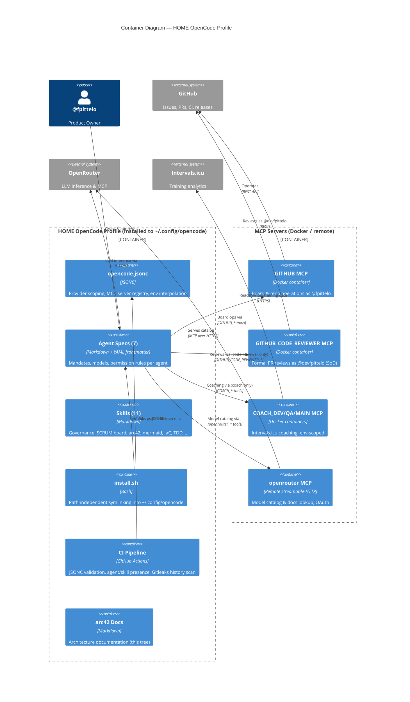

# 5. Building Block View

*Status: seeded (Sprint 03, STORY-02 #59).*

## 5.1 Whitebox Overall System

## 5.2 Level 2 — Motivation & Explanation

| Building block | Responsibility | Key interfaces |
| :--- | :--- | :--- |
| `opencode.jsonc` | Single runtime configuration: `enabled_providers: ["openrouter"]`, MCP registry, `{env:VAR}` secret interpolation | OpenCode runtime schema (https://opencode.ai/config.json) |
| `agents/*.md` (7) | Role mandates, model assignments, permission boundaries (allow/deny, last-match-wins) | OpenCode agent loading; frontmatter schema |
| `skills/*/SKILL.md` (11) | Versioned domain knowledge activated on demand | Skill frontmatter (`name`, `description`) |
| `install.sh` | Path-independent installation (symlinks from `SCRIPT_DIR`) into `~/.config/opencode` | Bash, systemd env import |
| `.github/workflows/ci.yml` | Zero-warning gate: JSONC validation, agent/skill presence inventory, Gitleaks full-history scan | GitHub Actions |
| MCP servers | Platform integration with credential isolation; SoD via separate server + machine account | MCP stdio (Docker) / streamable-HTTP (remote) |

**Permission model invariants (enforced since #68, extended by #108):**
- `@code-reviewer`: `GITHUB_*: deny` then `GITHUB_CODE_REVIEWER_*: allow` — acts ONLY as `@devfpittelo`.
- All other agents: `GITHUB_*: allow` then `GITHUB_CODE_REVIEWER_*: deny` — cannot impersonate the reviewer.
- `@coach` only: `COACH_DEV_*` / `COACH_QA_*` / `COACH_MAIN_*`: allow — Coach MCP is coach-only (SoD).
- All other agents: `COACH_DEV_*` / `COACH_QA_*` / `COACH_MAIN_*`: deny.
- `@architect` and `@coach` only: `openrouter_*: allow`; all other agents `openrouter_*: deny` (supersedes #67's "all agents" rule).

## 5.3 Level 3

Not required at this stage — the profile is configuration, not layered code. Component-level detail may be added for the harness (`harness/`) if it grows.