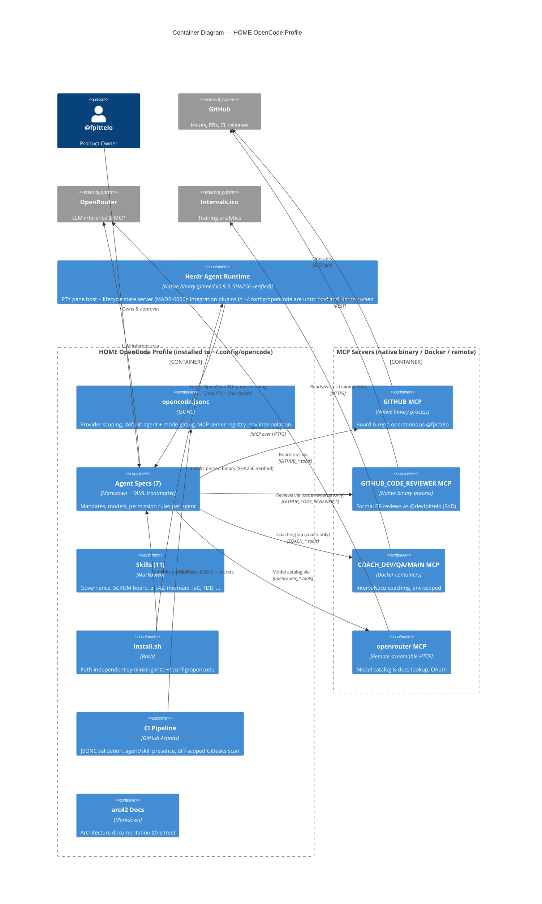

# 5. Building Block View

*Status: seeded (Sprint 03, STORY-02 #59).*

## 5.1 Whitebox Overall System

```mermaid
C4Container
    title Container Diagram — HOME OpenCode Profile

    Person(fpittelo, "@fpittelo", "Product Owner")
    System_Ext(github, "GitHub", "Issues, PRs, CI, releases")
    System_Ext(openrouter_api, "OpenRouter", "LLM inference & MCP")
    System_Ext(intervals, "Intervals.icu", "Training analytics")

    Container_Boundary(home_profile, "HOME OpenCode Profile (installed to ~/.config/opencode)") {
        Container(opencode_jsonc, "opencode.jsonc", "JSONC", "Provider scoping, default agent + mode gating, MCP server registry, env interpolation")
        Container(agents, "Agent Specs (7)", "Markdown + YAML frontmatter", "Mandates, models, permission rules per agent")
        Container(skills, "Skills (11)", "Markdown", "Governance, SCRUM board, arc42, mermaid, IaC, TDD, ...")
        Container(installer, "install.sh", "Bash", "Path-independent symlinking into ~/.config/opencode")
        Container(ci, "CI Pipeline", "GitHub Actions", "JSONC validation, agent/skill presence, diff-scoped Gitleaks scan")
        Container(arc42docs, "arc42 Docs", "Markdown", "Architecture documentation (this tree)")
    }

    Container_Boundary(mcp_servers, "MCP Servers (native binary / Docker / remote)") {
        Container(mcp_github, "GITHUB MCP", "Native binary process", "Board & repo operations as @fpittelo")
        Container(mcp_reviewer, "GITHUB_CODE_REVIEWER MCP", "Native binary process", "Formal PR reviews as @devfpittelo (SoD)")
        Container(mcp_coach, "COACH_DEV/QA/MAIN MCP", "Docker containers", "Intervals.icu coaching, env-scoped")
        Container(mcp_openrouter, "openrouter MCP", "Remote streamable-HTTP", "Model catalog & docs lookup, OAuth")
    }

    Container(herdr_runtime, "Herdr Agent Runtime", "Native binary (pinned v0.9.3, SHA256-verified)", "PTY pane host + lifecycle state server (MADR-0005); integration plugins in ~/.config/opencode are untracked and Herdr-owned")

    Rel(fpittelo, agents, "Owns & approves")
    Rel(agents, mcp_github, "Board ops via", "GITHUB_* tools")
    Rel(agents, mcp_reviewer, "Reviews via (code-reviewer only)", "GITHUB_CODE_REVIEWER_*")
    Rel(agents, mcp_coach, "Coaching via (coach only)", "COACH_* tools")
    Rel(agents, mcp_openrouter, "Model catalog via", "openrouter_* tools")
    Rel(agents, openrouter_api, "LLM inference via", "HTTPS")
    Rel(mcp_github, github, "Operates", "REST API")
    Rel(mcp_reviewer, github, "Reviews as @devfpittelo", "REST")
    Rel(mcp_coach, intervals, "Reads/writes training data", "HTTPS")
    Rel(mcp_openrouter, openrouter_api, "Serves catalog", "MCP over HTTPS")
    Rel(installer, agents, "Symlinks profile files")
    Rel(installer, herdr_runtime, "Installs pinned binary (SHA256-verified)")
    Rel(herdr_runtime, agents, "Hosts OpenCode TUI panes running", "real PTY + Unix socket")
    Rel(ci, opencode_jsonc, "Validates JSONC + secrets")
```

## 5.2 Level 2 — Motivation & Explanation

| Building block | Responsibility | Key interfaces |
| :--- | :--- | :--- |
| `opencode.jsonc` | Single runtime configuration: `enabled_providers: ["openrouter"]`, `default_agent: "architect"` + built-in `build`/`plan` mode disabling (#149), MCP registry, `{env:VAR}` secret interpolation | OpenCode runtime schema (https://opencode.ai/config.json) |
| `agents/*.md` (7) | Role mandates, model assignments, permission boundaries (allow/deny, last-match-wins) | OpenCode agent loading; frontmatter schema |
| `skills/*/SKILL.md` (11) | Versioned domain knowledge activated on demand | Skill frontmatter (`name`, `description`) |
| `install.sh` | Path-independent installation (symlinks from `SCRIPT_DIR`) into `~/.config/opencode`; installs the pinned `github-mcp-server` and Herdr binaries (SHA256-verified, idempotent) | Bash, systemd env import |
| `.github/workflows/ci.yml` | Zero-warning gate: JSONC validation, agent/skill presence inventory, diff-scoped Gitleaks scan per PR (pinned gitleaks-action v3.0.0); full-history scan runs in the scheduled `deep-validation.yml` (MADR-0003) | GitHub Actions |
| MCP servers | Platform integration with credential isolation; SoD via separate server + machine account | MCP stdio (native binary / Docker) / streamable-HTTP (remote) |
| Herdr runtime (MADR-0005) | Hosts OpenCode TUI panes as real PTYs; reports agent lifecycle (working/blocked/idle); sessions survive detach (`ctrl+b q` → `herdr`) and server restarts | `herdr` CLI (client/server), Unix socket `~/.config/herdr/herdr.sock`, integration plugins in `~/.config/opencode/` (untracked, Herdr-owned) |

**Permission model invariants (enforced since #68, extended by #108, #150):**
- `@code-reviewer`: `GITHUB_*: deny` then `GITHUB_CODE_REVIEWER_*: allow` — acts ONLY as `@devfpittelo`.
- All other agents: `GITHUB_*: allow` then `GITHUB_CODE_REVIEWER_*: deny` — cannot impersonate the reviewer.
- Global default-deny baseline (#150): `opencode.jsonc` denies `COACH_DEV_*` / `COACH_QA_*` / `COACH_MAIN_*` at the root `permission` level — built-in subagents (`explore`, `general`, `task`) and any unconfigured persona inherit zero Coach MCP access.
- `@coach` only: `COACH_DEV_*` / `COACH_QA_*` / `COACH_MAIN_*`: allow — Coach MCP is coach-only (SoD); `agents/coach.md` is the sole allow whitelist.
- All other agents: `COACH_DEV_*` / `COACH_QA_*` / `COACH_MAIN_*`: deny (explicit per-agent backstop of the global baseline).
- `@architect` and `@coach` only: `openrouter_*: allow`; all other agents `openrouter_*: deny` (supersedes #67's "all agents" rule).
- The coach-exclusivity invariant is machine-enforced by `harness/config-validation/check_coach_exclusivity.py` (gate 8/8 of `harness/run-config-gate.sh` and a dedicated CI step in `ci.yml`).

**Mode gating invariants (enforced since #149):**
- `opencode.jsonc` sets `"default_agent": "architect"` — every OpenCode session launches into the governed Solution Architect persona (`agents/architect.md` declares `mode: primary`).
- Built-in `build` and `plan` modes are disabled (`"agent": { "build": { "disable": true }, "plan": { "disable": true } }`) — the TUI mode switcher offers governed HOME SCRUM agents only.

## 5.3 Level 3

Not required at this stage — the profile is configuration, not layered code. Component-level detail may be added for the harness (`harness/`) if it grows.
