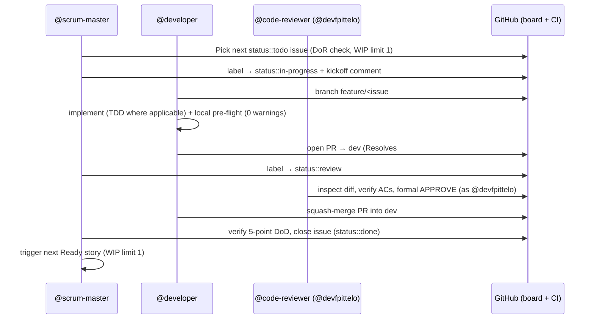

# 6. Runtime View

*Status: seeded (Sprint 03, STORY-02 #59).*

## 6.1 Scenario: Autonomous Issue-by-Issue Delivery Loop

**Trigger:** a sprint milestone is active with at least one `status::todo` issue, and @fpittelo has authorized the loop.

**Postconditions:** issue closed with full traceability (squash SHA, PR, CI run, review links); `dev` advanced by exactly one squash commit.

**Failure modes:** pre-flight or CI failure → developer self-remediation (max 3 attempts, then `blocker::active` escalation to @architect per the circuit breaker).

## 6.2 Scenario: Promotion & Release (human-gated)

**Trigger:** all sprint deliverables merged into `dev`.

1. @fpittelo explicitly approves → @devops merges `dev` → `qa` (CI must be green).
2. @fpittelo explicitly approves → @devops merges `qa` → `main`.
3. Release tag `vX.Y.Z` + GitHub Release; @scrum-master runs board hygiene (audit, label cleanup, milestone close, retrospective, next-sprint initialization).

## 6.3 Scenario: Architecture Change → Documentation Update

**Trigger:** any change to agents, skills, MCP servers, or policies.

1. @architect identifies affected arc42 sections via the update-trigger table (`arc42-documentation` skill §4).
2. The arc42 update travels **in the same feature branch and PR** as the change.
3. @code-reviewer verifies documentation parity alongside the code/config change.