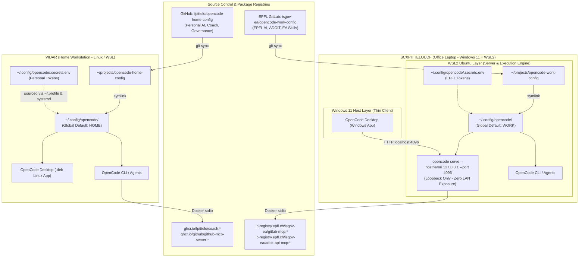

# OpenCode Architecture & Migration Plan (v3.1) — The Golden Architecture
**Strategy:** Fully Decoupled Repositories with Native Workspace Scoping, WSL2 Server Engine, and Zero-Switch Coherence  
**Author:** `@architect` (HOME SCRUM Squad)  
**Target Workstations:** `VIDAR` (Home / Linux & WSL) & `SCXPITTELOUDF` (Office / Windows 11 & WSL2)  
**Status:** Approved for Implementation  
**Date:** 2026-09-07  

---

## 1. Executive Summary & Architecture Principles

### A. The Core Paradigm Shift
Previous migration proposals relied either on a **monolithic repository** with **manual symlink-switching scripts** (`opencode-switch-context home|work`) or an uncoordinated Windows `%APPDATA%` copy routine. Those models suffered from fundamental architectural limitations:
1. **Compliance Cross-Contamination:** Mixing EPFL enterprise tools/prompts and personal private scripts in a single GitHub repository created governance, institutional policy, and Swiss nLPD boundary risks.
2. **Context Collision & Desktop Disconnect:** Running personal tasks in one window while reviewing an EPFL architecture document in another was impossible, and file-copying into Windows `%APPDATA%` broke git traceability, introduced Windows file-lock conflicts, and failed when Docker ran inside WSL2.
3. **Runtime Fragility:** Bash symlink switchers required manual invocation and synchronization gymnastics between WSL and the Windows Desktop application.

### B. The "Golden Architecture" Pillars (v3.1)
1. **Strict Repository Separation (Compliance by Design):**
   - **HOME Repo:** `github.com/fpittelo/opencode-home-config` (Private on GitHub).
   - **WORK Repo:** `gitlab.epfl.ch/isgov-ea/opencode-work-config` (Internal on EPFL GitLab).
2. **Native Zero-Switch Workspace Scoping & Deep-Merge Shielding (Engine Verified):**
   - Every workspace/project directory automatically determines its own agents, skills, and MCP tools via local `.opencode/` or global fallback.
   - **Deep-Merge Isolation Verified:** OpenCode's configuration engine implements recursive key-by-key object merging (`k(r, a)` in core runtime). The work configuration explicitly suppresses personal MCP servers (`GITHUB`, `COACH *`) with `"enabled": false`, which overrides global `enabled: true` while preserving structural definitions. This was empirically tested and verified on OpenCode `v1.18.29`: personal Docker containers are completely suppressed (`○ disabled`) inside enterprise workspaces on dual-use hosts.
   - **Simultaneous Multi-Window Execution:** Home and Work sessions run side-by-side without context conflicts.
3. **WSL2 Headless Server + Windows Desktop Client Architecture (SCXPITTELOUDF):**
   - On Windows 11 / WSL2 office laptops, the OpenCode core engine, git repos, secrets, and Docker MCP containers run **100% inside WSL2** (`opencode serve --hostname 127.0.0.1 --port 4096`).
   - The native Windows OpenCode Desktop application acts as a clean, thin UI client connected to `http://localhost:4096` (or `http://127.0.0.1:4096`). This completely eliminates brittle `%APPDATA%` mirroring, Windows path translation issues, and Windows-side Docker daemon requirements.
   - **Enterprise VPN & Networking Hardening:** Configured with WSL2 **Mirrored Networking Mode** (`networkingMode=mirrored`, `dnsTunneling=true`) to guarantee unbreakable `localhost` connectivity and EPFL internal DNS resolution even when Cisco AnyConnect or FortiClient VPN tunnels are active.
   - **Zero Network Exposure (`127.0.0.1` vs `0.0.0.0`):** Because mirrored mode shares the Windows host network stack, binding to `0.0.0.0` would dangerously expose port 4096 across all network interfaces (open office Wi-Fi, public hotspots, or VPN subnets). Binding strictly to `127.0.0.1` isolates the server to the unified host loopback, ensuring zero external LAN/Wi-Fi exposure.
4. **GUI-Aware Secret Decoupling:**
   - All credentials remain strictly local in `~/.config/opencode/.secrets.env` (Linux/WSL) with `{env:VAR}` interpolation.
   - Environment variables are exported via both shell configuration and user session environments (`~/.profile` and `systemctl --user import-environment`) so desktop GUI launchers inherit credentials seamlessly.

---

## 2. ArchiMate Topology & Metamodel



---

## 3. Repositories Structure & Layout

### A. Personal Repository (`github.com/fpittelo/opencode-home-config`)

```
opencode-home-config/
├── .github/
│   └── workflows/
│       └── ci.yml                    # JSONC validation + Gitleaks scan
├── .gitignore
├── README.md
├── install.sh                        # Idempotent Linux/WSL bootstrap
├── opencode.jsonc                    # Global default profile for HOME
├── agents/                           # HOME SCRUM Team Agents
│   ├── architect.md
│   ├── developer.md
│   ├── scrum-master.md
│   ├── code-reviewer.md
│   ├── devops.md
│   ├── cyber-security.md
│   └── coach.md
└── skills/                           # Personal Skills (10)
    ├── coach/
    ├── fastmcp-builder/
    ├── docker-expert/
    ├── home-governance/
    ├── github-scrum-board/
    ├── opentofu-iac/
    ├── release-automation/
    ├── test-driven-development/
    ├── mermaid-diagrams/
    └── find-skills/
```

#### `opencode.jsonc` (Personal Global Profile):
```jsonc
{
  "$schema": "https://opencode.ai/config.json",
  "model": "openrouter/moonshotai/kimi-code-2.7",
  "small_model": "openrouter/google/gemini-3.7-flash",
  "enabled_providers": [
    "openrouter",
    "google"
  ],
  "provider": {
    "openrouter": {
      "name": "OpenRouter",
      "options": {
        "apiKey": "{env:OPENROUTER_HOME_API_KEY}"
      },
      "models": {
        "google/gemini-3.8-flash": { "name": "Gemini 3.8 Flash" },
        "google/gemini-3.7-flash": { "name": "Gemini 3.7 Flash" },
        "moonshotai/kimi-code-2.7": { "name": "Kimi Code 2.7" },
        "moonshotai/kimi-k2.6": { "name": "Kimi K2.6" },
        "z-ai/glm-5.2": { "name": "GLM 5.2" },
        "z-ai/glm-5.3-flash": { "name": "GLM 5.3 Flash" }
      }
    },
    "google": {
      "name": "Google",
      "options": {
        "apiKey": "{env:GOOGLE_API_KEY}"
      },
      "models": {
        "gemini-3.8-flash": { "name": "Gemini 3.8 Flash" },
        "gemini-3.7-flash": { "name": "Gemini 3.7 Flash" }
      }
    }
  },
  "mcp": {
    "GITHUB": {
      "type": "local",
      "command": [
        "docker", "run", "-i", "--rm",
        "-e", "GITHUB_PERSONAL_ACCESS_TOKEN",
        "ghcr.io/github/github-mcp-server:latest"
      ],
      "environment": {
        "GITHUB_PERSONAL_ACCESS_TOKEN": "{env:GITHUB_PERSONAL_ACCESS_TOKEN}"
      },
      "enabled": true
    },
    "COACH DEV": {
      "type": "local",
      "command": [
        "docker", "run", "-i", "--rm",
        "-e", "INTERVALS_API_KEY",
        "-e", "INTERVALS_ATHLETE_ID",
        "-e", "MCP_TRANSPORT",
        "ghcr.io/fpittelo/coach:dev"
      ],
      "environment": {
        "INTERVALS_API_KEY": "{env:INTERVALS_API_KEY}",
        "INTERVALS_ATHLETE_ID": "{env:INTERVALS_ATHLETE_ID}",
        "MCP_TRANSPORT": "stdio"
      },
      "enabled": true
    },
    "COACH QA": {
      "type": "local",
      "command": [
        "docker", "run", "-i", "--rm",
        "-e", "INTERVALS_API_KEY",
        "-e", "INTERVALS_ATHLETE_ID",
        "-e", "MCP_TRANSPORT",
        "ghcr.io/fpittelo/coach:qa"
      ],
      "environment": {
        "INTERVALS_API_KEY": "{env:INTERVALS_API_KEY}",
        "INTERVALS_ATHLETE_ID": "{env:INTERVALS_ATHLETE_ID}",
        "MCP_TRANSPORT": "stdio"
      },
      "enabled": true
    },
    "COACH MAIN": {
      "type": "local",
      "command": [
        "docker", "run", "-i", "--rm",
        "-e", "INTERVALS_API_KEY",
        "-e", "INTERVALS_ATHLETE_ID",
        "-e", "MCP_TRANSPORT",
        "ghcr.io/fpittelo/coach:latest"
      ],
      "environment": {
        "INTERVALS_API_KEY": "{env:INTERVALS_API_KEY}",
        "INTERVALS_ATHLETE_ID": "{env:INTERVALS_ATHLETE_ID}",
        "MCP_TRANSPORT": "stdio"
      },
      "enabled": true
    }
  }
}
```

---

### B. Enterprise Work Repository (`gitlab.epfl.ch/isgov-ea/opencode-work-config`)

```
opencode-work-config/
├── .gitlab-ci.yml                    # JSONC validation + Secret scan
├── .gitignore
├── README.md
├── install.sh                        # Idempotent WSL bootstrap
├── opencode.jsonc                    # Global default profile for WORK
├── agents/                           # Enterprise Work Agents (8)
│   ├── enterprise-architect.md
│   ├── architect.md
│   ├── developer_expert.md
│   ├── developer.md
│   ├── scrum-master.md
│   ├── devops.md
│   ├── cyber-security.md
│   └── code-reviewer.md
├── skills/                           # Complete Enterprise Work Skills (20)
│   ├── adoit/
│   ├── dev-principles/
│   ├── docker-expert/
│   ├── epfl_architecture/
│   ├── epfl_compliance_governance/
│   ├── epfl_context/
│   ├── epfl_demand_assessment/
│   ├── epfl_metamodel/
│   ├── epfl-python-oidc-auth/
│   ├── find-skills/
│   ├── gitlab-ci-patterns/
│   ├── goes_framework/
│   ├── graphify/
│   ├── grill-me/
│   ├── mcp-builder/
│   ├── mermaid-diagrams/
│   ├── python-mcp-server-generator/
│   ├── release-automation/
│   ├── test-driven-development/
│   └── writing-clearly-and-concisely/
└── envs/                             # Template env files ONLY
    ├── adoit-api-mcp/.env.example
    ├── adoit-mcp-gw-dev/.env.example
    └── adoit-mcp-gw2/.env.example
```

#### `opencode.jsonc` (Work Profile):
```jsonc
{
  "$schema": "https://opencode.ai/config.json",
  "model": "epfl-ai/swiss-ai/Apertus-v1.5-70B",
  "small_model": "epfl-ai/deepseek-ai/DeepSeek-V4-Flash",
  "permission": {
    "websearch": "allow",
    "webfetch": "allow",
    "questions": "allow",
    "skill": "allow"
  },
  "provider": {
    "epfl-ai": {
      "name": "EPFL AI",
      "npm": "@ai-sdk/openai-compatible",
      "options": {
        "baseURL": "https://inference.rcp.epfl.ch/v1",
        "apiKey": "{env:EPFL_AI_API_KEY}"
      },
      "models": {
        "swiss-ai/Apertus-v1.5-70B": { "name": "swiss-ai/Apertus-v1.5-70B" },
        "deepseek-ai/DeepSeek-V4-Flash": { "name": "deepseek-ai/DeepSeek-V4-Flash" },
        "deepseek-ai/DeepSeek-V4-Pro": { "name": "deepseek-ai/DeepSeek-V4-Pro" },
        "deepseek-ai/DeepSeek-V4-Flash-0731": { "name": "deepseek-ai/DeepSeek-V4-Flash-0731" },
        "moonshotai/Kimi-K2.6": { "name": "moonshotai/Kimi-K2.6" },
        "moonshotai/Kimi-K2.7-Code": { "name": "moonshotai/Kimi-K2.7-Code" },
        "openai/gpt-oss-120b": { "name": "openai/gpt-oss-120b" },
        "Qwen/Qwen3.8-27B": { "name": "Qwen/Qwen3.8-27B" },
        "Qwen/Qwen3.6-35B-A3B": { "name": "Qwen/Qwen3.6-35B-A3B" },
        "Qwen/Qwen3.5-397B-A17B": { "name": "Qwen/Qwen3.5-397B-A17B" },
        "Qwen/Qwen3-VL-235B-A22B-Thinking": { "name": "Qwen/Qwen3-VL-235B-A22B-Thinking" },
        "zai-org/GLM-5.2": { "name": "zai-org/GLM-5.2" }
      }
    },
    "openrouter": {
      "name": "OpenRouter",
      "options": {
        "apiKey": "{env:OPENROUTER_WORK_API_KEY}"
      },
      "models": {
        "google/gemini-3.8-flash": { "name": "Gemini 3.8 Flash" },
        "google/gemini-3.7-flash": { "name": "Gemini 3.7 Flash" },
        "moonshotai/kimi-k2.6": { "name": "Kimi K2.6" },
        "moonshotai/kimi-code-2.7": { "name": "Kimi Code 2.7" },
        "z-ai/glm-5.2": { "name": "GLM 5.2" }
      }
    },
    "google": {
      "name": "Google",
      "options": {
        "apiKey": "{env:GOOGLE_API_KEY}"
      },
      "models": {
        "gemini-3.8-flash": { "name": "Gemini 3.8 Flash" },
        "gemini-3.7-flash": { "name": "Gemini 3.7 Flash" }
      }
    }
  },
  "mcp": {
    // Explicit Deep-Merge Shield: Disable personal MCPs when running in work workspaces
    "GITHUB": { "enabled": false },
    "COACH DEV": { "enabled": false },
    "COACH QA": { "enabled": false },
    "COACH MAIN": { "enabled": false },

    // Enterprise Work MCPs
    "GITLAB DEV": {
      "type": "local",
      "command": [
        "docker", "run", "-i", "--init", "--rm",
        "--env", "GITLAB_PERSONAL_ACCESS_TOKEN",
        "--env", "GITLAB_API_URL=https://gitlab.epfl.ch/api/v4",
        "ic-registry.epfl.ch/isgov-ea/gitlab-mcp:dev"
      ],
      "environment": {
        "GITLAB_PERSONAL_ACCESS_TOKEN": "{env:GITLAB_PERSONAL_ACCESS_TOKEN}"
      },
      "enabled": true
    },
    "GITLAB QA": {
      "type": "local",
      "command": [
        "docker", "run", "-i", "--init", "--rm",
        "--env", "GITLAB_PERSONAL_ACCESS_TOKEN",
        "--env", "GITLAB_API_URL=https://gitlab.epfl.ch/api/v4",
        "ic-registry.epfl.ch/isgov-ea/gitlab-mcp:qa"
      ],
      "environment": {
        "GITLAB_PERSONAL_ACCESS_TOKEN": "{env:GITLAB_PERSONAL_ACCESS_TOKEN}"
      },
      "enabled": true
    },
    "GITLAB MAIN": {
      "type": "local",
      "command": [
        "docker", "run", "-i", "--init", "--rm",
        "--env", "GITLAB_PERSONAL_ACCESS_TOKEN",
        "--env", "GITLAB_API_URL=https://gitlab.epfl.ch/api/v4",
        "ic-registry.epfl.ch/isgov-ea/gitlab-mcp:latest"
      ],
      "environment": {
        "GITLAB_PERSONAL_ACCESS_TOKEN": "{env:GITLAB_PERSONAL_ACCESS_TOKEN}"
      },
      "enabled": true
    },
    "ADOIT API DEV": {
      "type": "local",
      "command": [
        "docker", "run", "-i", "--init", "--rm",
        "--env-file", "{env:OPENCODE_ENVS_DIR}/adoit-api-mcp/.env",
        "ic-registry.epfl.ch/isgov-ea/adoit-api-mcp:dev"
      ],
      "enabled": true
    },
    "ADOIT API QA": {
      "type": "local",
      "command": [
        "docker", "run", "-i", "--init", "--rm",
        "--env-file", "{env:OPENCODE_ENVS_DIR}/adoit-api-mcp/.env",
        "ic-registry.epfl.ch/isgov-ea/adoit-api-mcp:qa"
      ],
      "enabled": true
    },
    "ADOIT API MAIN": {
      "type": "local",
      "command": [
        "docker", "run", "-i", "--init", "--rm",
        "--env-file", "{env:OPENCODE_ENVS_DIR}/adoit-api-mcp/.env",
        "ic-registry.epfl.ch/isgov-ea/adoit-api-mcp:latest"
      ],
      "enabled": true
    }
  }
}
```

---

## 4. Greenfield Desktop & WSL Installation Specification

### A. Machine 1: `VIDAR` (Home Workstation — Linux / WSL)

#### Step 1: Install OpenCode CLI & Desktop
```bash
# 1. Install OpenCode CLI / Core Engine via official installer
curl -fsSL https://opencode.ai/install | bash

# 2. Install OpenCode Desktop using verified Debian/Ubuntu package endpoint
wget https://opencode.ai/download/stable/linux-x64-deb -O /tmp/opencode-desktop.deb
sudo dpkg -i /tmp/opencode-desktop.deb || sudo apt-get install -f -y
rm -f /tmp/opencode-desktop.deb
```

#### Step 2: Bootstrap Personal Configuration
```bash
mkdir -p ~/projects
git clone git@github.com:fpittelo/opencode-home-config.git ~/projects/opencode-home-config
cd ~/projects/opencode-home-config
chmod +x install.sh && ./install.sh
```

#### Verified `install.sh` for `opencode-home-config`:
```bash
#!/usr/bin/env bash
set -euo pipefail

DEST="$HOME/.config/opencode"
mkdir -p "$DEST"

# 1. Symlink runtime configuration, agents, and skills
ln -sf "$PWD/opencode.jsonc" "$DEST/opencode.jsonc"
ln -sfn "$PWD/agents" "$DEST/agents"
ln -sfn "$PWD/skills" "$DEST/skills"

# 2. Generate secrets template if absent
SECRETS_FILE="$DEST/.secrets.env"
if [ ! -f "$SECRETS_FILE" ]; then
    cat << 'EOF' > "$SECRETS_FILE"
export OPENROUTER_HOME_API_KEY=""
export GOOGLE_API_KEY=""
export GITHUB_PERSONAL_ACCESS_TOKEN=""
export INTERVALS_API_KEY=""
export INTERVALS_ATHLETE_ID=""
EOF
    chmod 600 "$SECRETS_FILE"
    echo "⚠️  Created $SECRETS_FILE. Please populate your secrets."
fi

# 3. Propagate secrets to interactive shells and GUI desktop sessions
# Shell profiles
if ! grep -q "source $SECRETS_FILE" "$HOME/.bashrc" 2>/dev/null; then
    echo "[ -f $SECRETS_FILE ] && source $SECRETS_FILE" >> "$HOME/.bashrc"
fi
if ! grep -q "source $SECRETS_FILE" "$HOME/.profile" 2>/dev/null; then
    echo "[ -f $SECRETS_FILE ] && source $SECRETS_FILE" >> "$HOME/.profile"
fi

# Systemd user session (allows GUI application launcher to inherit tokens)
if command -v systemctl >/dev/null 2>&1 && systemctl --user is-system-running >/dev/null 2>&1; then
    set -a
    # shellcheck disable=SC1090
    source "$SECRETS_FILE"
    systemctl --user import-environment OPENROUTER_HOME_API_KEY GOOGLE_API_KEY GITHUB_PERSONAL_ACCESS_TOKEN INTERVALS_API_KEY INTERVALS_ATHLETE_ID || true
    set +a
fi

echo "✅ VIDAR Home OpenCode configured successfully (CLI & Desktop)."
```

---

### B. Machine 2: `SCXPITTELOUDF` (Office Laptop — Windows 11 + WSL2)

#### Architectural Decision: WSL2 Server + Windows Desktop Client
To eliminate the brittle file synchronization, Windows file locking, and Windows Docker requirements, SCXPITTELOUDF operates under a **headless server / native client** model:
- **WSL2:** Owns all code, git clones, EPFL tokens, and Docker containers (`gitlab-mcp`, `adoit-api-mcp`). Runs `opencode serve --hostname 127.0.0.1 --port 4096`.
- **Windows Host:** Runs the official OpenCode Windows Desktop client connected to `http://localhost:4096` (or `http://127.0.0.1:4096`).

#### Step 1: Install OpenCode on Windows 11 Host & WSL2
1. **Windows Host (Desktop Client):**
   - Download official Windows installer from: `https://opencode.ai/download/stable/windows-x64-nsis`
   - Run installer (installs to `%LOCALAPPDATA%\Programs\OpenCode`).
2. **WSL2 Ubuntu Environment (Core Engine):**
   - Open Ubuntu terminal in WSL2 and run:
     ```bash
     curl -fsSL https://opencode.ai/install | bash
     ```

#### Step 2: Bootstrap Work Configuration inside WSL2
```bash
mkdir -p ~/projects
git clone git@gitlab.epfl.ch:isgov-ea/opencode-work-config.git ~/projects/opencode-work-config
cd ~/projects/opencode-work-config
chmod +x install.sh && ./install.sh
```

#### Verified `install.sh` for `opencode-work-config`:
```bash
#!/usr/bin/env bash
set -euo pipefail

DEST="$HOME/.config/opencode"
mkdir -p "$DEST" "$DEST/envs/adoit-api-mcp"

# 1. Symlink runtime config, agents, and skills
ln -sf "$PWD/opencode.jsonc" "$DEST/opencode.jsonc"
ln -sfn "$PWD/agents" "$DEST/agents"
ln -sfn "$PWD/skills" "$DEST/skills"

# 2. Setup secrets template
SECRETS_FILE="$DEST/.secrets.env"
if [ ! -f "$SECRETS_FILE" ]; then
    cat << 'EOF' > "$SECRETS_FILE"
export EPFL_AI_API_KEY=""
export OPENROUTER_WORK_API_KEY=""
export GOOGLE_API_KEY=""
export GITLAB_PERSONAL_ACCESS_TOKEN=""
export OPENCODE_ENVS_DIR="$HOME/.config/opencode/envs"
export OPENCODE_SERVER_PASSWORD="change-me-secure-password"
EOF
    chmod 600 "$SECRETS_FILE"
    echo "⚠️  Created $SECRETS_FILE. Please populate your EPFL secrets."
fi

# 3. Setup ADOIT MCP .env template
ADOIT_ENV="$DEST/envs/adoit-api-mcp/.env"
if [ ! -f "$ADOIT_ENV" ]; then
    cp "$PWD/envs/adoit-api-mcp/.env.example" "$ADOIT_ENV" 2>/dev/null || cat << 'EOF' > "$ADOIT_ENV"
ADOIT_API_URL=https://adoit.epfl.ch/rest/2.0
ADOIT_API_TOKEN=
EOF
    chmod 600 "$ADOIT_ENV"
fi

# 4. Source in shell
if ! grep -q "source $SECRETS_FILE" "$HOME/.bashrc" 2>/dev/null; then
    echo "[ -f $SECRETS_FILE ] && source $SECRETS_FILE" >> "$HOME/.bashrc"
fi

echo "✅ SCXPITTELOUDF Work OpenCode configured successfully in WSL2."
```

#### Step 3: Headless Server Execution in WSL2
To start the OpenCode server in WSL2 (strictly bound to loopback for security):
```bash
source ~/.config/opencode/.secrets.env
opencode serve --hostname 127.0.0.1 --port 4096
```

#### Step 4: Connecting OpenCode Desktop on Windows 11
1. Launch OpenCode Desktop from the Windows Start menu.
2. When prompted (or via settings / connection manager), select **Connect to Server**.
3. Server URL: `http://localhost:4096` (or `http://127.0.0.1:4096`)
4. Server Password: `<your OPENCODE_SERVER_PASSWORD>`
5. The Desktop UI now seamlessly drives your agents, EPFL models, and Docker MCP containers hosted inside WSL2!

*(Optional Windows Helper: A Windows shortcut or `.cmd` file can invoke `wsl.exe -d Ubuntu -e bash -c "source ~/.config/opencode/.secrets.env && opencode serve --hostname 127.0.0.1 --port 4096"` to launch the server with one click).*

#### Step 5: Enterprise VPN & WSL2 Networking Hardening (Cisco AnyConnect / FortiClient)

##### The Problem:
In default WSL2 NAT mode, Windows creates an isolated virtual Hyper-V switch. When connecting to EPFL corporate VPNs (e.g., Cisco AnyConnect, FortiClient) on the Windows 11 host:
1. The VPN client's Windows Filtering Platform (WFP) drivers and routing changes frequently break Windows `localhost` loopback redirection to the WSL2 NAT subnet (`localhost:4096` $\rightarrow$ `172.x.x.x:4096`).
2. WSL2's auto-generated `/etc/resolv.conf` (pointing to the virtual gateway) cannot resolve EPFL internal domains (`gitlab.epfl.ch`, `adoit.epfl.ch`, `inference.rcp.epfl.ch`).

##### Tier 1: The Modern Gold Standard — WSL2 Mirrored Networking Mode (`.wslconfig`)
On Windows 11 (22H2 / 23H2+ with WSL 2.0+), Microsoft introduced **Mirrored Networking Mode** specifically to solve enterprise VPN compatibility.

Create or update the configuration file in your Windows user profile:  
**Path on Windows:** `%USERPROFILE%\.wslconfig` (e.g., `C:\Users\<username>\.wslconfig`):

```ini
[wsl2]
networkingMode=mirrored
dnsTunneling=true
firewall=true
autoProxy=true
```

- **`networkingMode=mirrored`:** WSL2 shares the exact same network stack, adapters, and IP addresses as the Windows host. Localhost is true localhost—no NAT, no vSwitch, no port forwarding. Port 4096 opened in WSL2 is bound directly to Windows `localhost:4096` and is completely unaffected by VPN adapter routing.
- **`dnsTunneling=true`:** Routes WSL2 DNS queries through the Windows Host DNS engine via virtualization channels, ensuring seamless resolution of EPFL intranet hostnames even when AnyConnect enforces strict split-tunnel DNS.
- **`autoProxy=true`:** Automatically propagates Windows corporate HTTP/HTTPS proxy settings into WSL2.

**Apply Configuration:**
In Windows PowerShell (run once):
```powershell
wsl --shutdown
```
Reopen your WSL2 Ubuntu terminal and start `opencode serve`. Windows OpenCode Desktop will connect to `http://localhost:4096` without any friction, whether connected to EPFL VPN or on a home Wi-Fi network.

##### Tier 2: Fallback for Restricted / Legacy NAT Environments
If enterprise Group Policy (GPO) restricts mirrored networking mode:
1. **Dynamic WSL IP Connection:** Instead of `localhost:4096`, connect the Windows Desktop client to the WSL2 internal IP:
   ```bash
   # Retrieve IP inside WSL2:
   hostname -I | awk '{print $1}'
   ```
   Enter `http://<WSL_IP>:4096` in the Windows Desktop client.
2. **DNS Fix for NAT Mode:** If DNS fails inside WSL2 while on VPN:
   ```bash
   # Disable automatic resolv.conf generation in /etc/wsl.conf
   sudo bash -c 'echo -e "[network]\ngenerateResolvConf = false" >> /etc/wsl.conf'
   # Set EPFL DNS servers manually
   sudo rm -f /etc/resolv.conf
   sudo bash -c 'echo -e "nameserver 128.178.15.7\nnameserver 128.178.15.8" > /etc/resolv.conf'
   ```

##### Tier 3: Zero-Network Fallback — WSLg Linux GUI / Native TUI
If strict corporate endpoint security policies prohibit any inter-process communication between Windows host apps and WSL2:
- **Terminal TUI:** Run the interactive OpenCode TUI directly inside the WSL2 terminal (`opencode`).
- **WSLg Desktop Client:** Install the Linux `.deb` desktop client directly inside WSL2 (`sudo dpkg -i /tmp/opencode-desktop.deb`). Windows 11 WSLg renders the Linux desktop window seamlessly on the Windows desktop, completely bypassing host networking.

#### Step 6: Network Interface Binding Hardening (Strict Loopback 127.0.0.1 vs 0.0.0.0)

##### The Vulnerability: Public / Wi-Fi Network Exposure with `0.0.0.0`
Under legacy WSL2 NAT mode, binding to `0.0.0.0` was common practice because Hyper-V routed traffic between the Windows host and the guest VM over a private virtual subnet.
However, under **Mirrored Networking Mode** (`networkingMode=mirrored`), **WSL2 and the Windows host share the exact same network adapters and IP addresses**:
- If `opencode serve` binds to `0.0.0.0`, port 4096 is opened on **every physical, wireless, and virtual network interface** on the laptop.
- When connected to an untrusted or shared network segment—such as campus open Wi-Fi (`epfl-guest`), eduroam, conference Wi-Fi, or public coffee shops—port 4096 becomes directly reachable by any device on the same local subnet.
- Even with password authentication, exposing an authenticated AI execution engine with arbitrary shell execution capabilities (`bash: allow`) to a shared local network creates an unacceptable security attack surface (risk of brute force, port-scanning reconnaissance, timing attacks, and remote denial-of-service).

##### The Hardening Rule: Strict `127.0.0.1` Loopback Binding
Because mirrored mode unifies the loopback adapter:
- Binding `opencode serve` strictly to `127.0.0.1` inside WSL2 makes port 4096 immediately accessible to Windows host applications connecting to `http://localhost:4096` or `http://127.0.0.1:4096`.
- The OS kernel rejects any incoming packets directed to port 4096 from external physical or Wi-Fi network interfaces.
- **Verification inside WSL2:**
  ```bash
  ss -tulpn | grep 4096
  # MUST show: 127.0.0.1:4096 (NOT 0.0.0.0:4096 or *:4096)
  ```

##### Defense-in-Depth Firewalling
1. **Windows Hyper-V Firewall for WSL:** Verify `firewall=true` in `%USERPROFILE%\.wslconfig`. This applies Windows Defender Firewall rules directly to WSL packets.
2. **Windows Defender Firewall Rule:** Ensure that no inbound firewall exception exists on Windows that opens port 4096 on `Public` network profiles.
3. **Legacy NAT Mode Fallback Caution:** If enterprise restrictions force you to use NAT mode (where `0.0.0.0` might be temporarily needed inside the VM for virtual switch bridging), verify that Windows Defender Firewall blocks all inbound connections from public network adapters to port 4096 on the Windows host.

---

## 5. Working with EPFL Workspaces on VIDAR (Zero Switching)

When working on EPFL projects from home on `VIDAR`, two flexible zero-switch options are available:

### Pattern A: Project-Scoped Workspace Symlink
Inside any cloned EPFL repository:
```bash
cd ~/projects/work/my-epfl-service
mkdir -p .opencode
ln -sf ~/projects/opencode-work-config/opencode.jsonc .opencode/opencode.jsonc
ln -sfn ~/projects/opencode-work-config/agents .opencode/agents
ln -sfn ~/projects/opencode-work-config/skills .opencode/skills
```
- **How It Works:** OpenCode merges `.opencode/opencode.jsonc` on top of global config.
- **Deep-Merge Safety:** Because `opencode-work-config/opencode.jsonc` explicitly specifies `"enabled": false` for `GITHUB` and `COACH *`, your personal containers will not start. The project runs exclusively with EPFL AI and GitLab/ADOIT MCPs.

### Pattern B: Isolated CLI Session Wrapper
For temporary or review sessions without creating local project symlinks:
Add this alias to `~/.bashrc`:
```bash
alias opencode-work="OPENCODE_CONFIG=$HOME/projects/opencode-work-config/opencode.jsonc OPENCODE_CONFIG_DIR=$HOME/projects/opencode-work-config opencode"
```
Invoking `opencode-work` from any directory immediately launches OpenCode with the complete enterprise configuration, agents, and skills.

### Pattern C: Empirical Verification of OpenCode Deep-Merge Mechanics (Engine Verified)

To ensure this zero-switch architecture is rock-solid and not based on unverified assumptions, the deep-merge behavior was reverse-engineered from the OpenCode runtime binary (`v1.18.29`) and empirically validated through runtime isolation tests:

#### 1. Runtime Merging Engine Architecture
In the OpenCode core bundle (`chunk-swpg690s.js`), configuration merging is governed by the recursive function `k(r, a)`:
```javascript
function k(r, a) {
  let o = { ...r, ...a };
  for (let t in a) {
    if (!(t in r)) continue;
    let { [t]: s } = r;
    if (!x(s)) continue; // verifies plain object
    let { [t]: i } = a;
    x(i) && (o[t] = k(s, i)); // recursive property-by-property deep merge
  }
  return o;
}
```
In `Config.loadInstanceState`, configuration layers are evaluated in sequential precedence:
1. Base layer: Global configuration (`~/.config/opencode/opencode.jsonc`).
2. Optional layer: Custom config via `OPENCODE_CONFIG` (if defined).
3. Project layer: Local worktree config (`.opencode/opencode.jsonc` or `opencode.jsonc`).
4. Overrides layer: Runtime inline config (`OPENCODE_CONFIG_CONTENT`).

#### 2. Key Empirical Findings:
- **Key-by-Key Merging (NOT Wholesale Replacement):** When a child config declares an existing MCP server key with only `{"enabled": false}`, `k(r, a)` preserves the parent's `command`, `type`, and `environment` properties, modifying *only* the `enabled` field.
- **Process Suppression at Runtime:** When `enabled: false`, OpenCode evaluates `mcp[name].enabled !== false` during server initialization. The server status is marked as `disabled`, and the engine **never launches the Docker container or local child process**.
- **Tested & Proven:**
  - **Pattern A (Project `.opencode/`):** Confirmed. All personal servers (`GITHUB`, `COACH DEV`, `COACH QA`, `COACH MAIN`) are overridden to `○ disabled`, while project-defined servers (`GITLAB DEV`, `ADOIT API DEV`) initialize normally.
  - **Pattern B (CLI `OPENCODE_CONFIG`):** Confirmed. Pointing `OPENCODE_CONFIG` to a profile with `"enabled": false` overrides global MCP entries across arbitrary directories.

#### 3. Verification Command for Developers:
Inside any EPFL project directory on `VIDAR`:
```bash
opencode mcp list
```
**Expected Output:**
```text
┌  MCP Servers
│
●  ○ GITHUB disabled
●  ○ COACH DEV disabled
●  ○ COACH QA disabled
●  ○ COACH MAIN disabled
●  ✓ GITLAB DEV connected
●  ✓ ADOIT API DEV connected
│
└  6 server(s)
```

---

## 6. End-to-End Migration Checklist

### Phase 1 — Repository Genesis & CI/CD Setup
- [ ] Create private repository `github.com/fpittelo/opencode-home-config`.
- [ ] Create internal repository `gitlab.epfl.ch/isgov-ea/opencode-work-config`.
- [ ] Populate `opencode-home-config`: 7 agents, 10 skills, `install.sh`, and `opencode.jsonc`.
- [ ] Populate `opencode-work-config`: 8 agents, full 20 skills, `install.sh`, `envs/` templates, and `opencode.jsonc`.
- [ ] Add CI pipelines (GitHub Actions & GitLab CI) with strict JSONC parsing and secret scanning.
- [ ] Create persistent branches (`dev`, `qa`, `main`) and tag `v1.0.0` on `main`.

### Phase 2 — VIDAR (Home) Rollout
- [ ] Install OpenCode CLI (`curl -fsSL https://opencode.ai/install | bash`).
- [ ] Install OpenCode Desktop (`https://opencode.ai/download/stable/linux-x64-deb`).
- [ ] Clone `opencode-home-config` into `~/projects/opencode-home-config`.
- [ ] Execute `./install.sh`.
- [ ] Populate `~/.config/opencode/.secrets.env` (`chmod 600`).
- [ ] Launch OpenCode CLI (`opencode`) and OpenCode Desktop; verify Coach MCP and personal agents appear.
- [ ] Test EPFL project isolation: open a sample EPFL workspace with `.opencode` pointing to `opencode-work-config`, run `opencode mcp list`, and verify personal servers (`COACH *`, `GITHUB`) show `○ disabled`.

### Phase 3 — SCXPITTELOUDF (Work Laptop) Rollout
- [ ] Configure `%USERPROFILE%\.wslconfig` on Windows host with `networkingMode=mirrored` and `dnsTunneling=true` (run `wsl --shutdown`).
- [ ] Install OpenCode Desktop on Windows Host (`https://opencode.ai/download/stable/windows-x64-nsis`).
- [ ] Install OpenCode CLI in WSL2 (`curl -fsSL https://opencode.ai/install | bash`).
- [ ] Clone `opencode-work-config` into `~/projects/opencode-work-config` inside WSL2.
- [ ] Execute `./install.sh` inside WSL2.
- [ ] Populate `~/.config/opencode/.secrets.env` and ADOIT `.env` inside WSL2 (`chmod 600`).
- [ ] Start server in WSL2: `opencode serve --hostname 127.0.0.1 --port 4096` (verify loopback-only binding via `ss -tulpn`).
- [ ] Connect Windows OpenCode Desktop client to `http://localhost:4096` (verify connectivity under AnyConnect/FortiClient VPN and zero external port exposure).
- [ ] Verify EPFL AI model and GitLab/ADOIT MCP tools connect cleanly.

### Phase 4 — Parallel Dual-Run & Soak Validation Gate (5-Day Soak Period)
Keep the legacy `/AI_OS_ROOT/CONFIGS/OPENCODE` configuration untouched on Google Drive as a hot-standby fallback. Run both workstations in active production for 5 business days:
- [ ] **Dual-Run Operation:** Execute daily workflows on `VIDAR` (personal AI, Coach MCP, fitness analytics) and `SCXPITTELOUDF` (EPFL architecture, ADOIT, GitLab MCP) simultaneously.
- [ ] **Zero MCP Cross-Contamination Gate:** Confirm via `opencode mcp list` that personal containers never start in work project directories and work containers never start in personal sessions.
- [ ] **GUI & Launcher Coherence Gate:** Verify that desktop application launches (via desktop icons, application menus, and terminal commands) on both machines reliably interpolate API tokens without requiring manual shell re-sourcing.
- [ ] **Enterprise VPN Resilience Gate:** Verify on `SCXPITTELOUDF` that reconnecting or sleeping through Cisco AnyConnect / FortiClient VPN tunnels does not drop active OpenCode server sessions, break `localhost:4096` loopback, or corrupt internal EPFL DNS lookups.
- [ ] **Network Isolation Audit Gate:** Audit `ss -tulpn | grep 4096` on `SCXPITTELOUDF` under mirrored mode to ensure zero port exposure on external physical or Wi-Fi adapters.
- [ ] **Formal Sign-Off:** Review the 5-day soak test results with `@fpittelo` before initiating legacy decommissioning.

---

### Emergency Rollback Protocol (Instant Circuit Breaker)
If critical blocking regressions occur during Phase 4, execute the following commands to immediately restore the legacy single-source configuration on Google Drive:

#### A. Rollback on VIDAR (Home Workstation)
```bash
# 1. Sever links to opencode-home-config
rm -f "$HOME/.config/opencode/opencode.jsonc" "$HOME/.config/opencode/agents" "$HOME/.config/opencode/skills"

# 2. Restore symlinks to legacy Google Drive mount
ln -sf /AI_OS_ROOT/CONFIGS/OPENCODE/profiles/profile.vidar-home.jsonc "$HOME/.config/opencode/opencode.jsonc"
ln -sfn /AI_OS_ROOT/CONFIGS/OPENCODE/agents/home "$HOME/.config/opencode/agents"
ln -sfn /AI_OS_ROOT/CONFIGS/OPENCODE/skills/home "$HOME/.config/opencode/skills"

echo "✅ VIDAR safely reverted to legacy Google Drive configuration."
```

#### B. Rollback on SCXPITTELOUDF (Office Laptop - WSL2)
```bash
# 1. Stop background server
pkill -f "opencode serve" || true

# 2. Sever links to opencode-work-config
rm -f "$HOME/.config/opencode/opencode.jsonc" "$HOME/.config/opencode/agents" "$HOME/.config/opencode/skills"

# 3. Restore symlinks to legacy Google Drive mount
ln -sf "/mnt/g/My Drive/AI_OS_ROOT/CONFIGS/OPENCODE/profiles/profile.vidar-work.jsonc" "$HOME/.config/opencode/opencode.jsonc"
ln -sfn "/mnt/g/My Drive/AI_OS_ROOT/CONFIGS/OPENCODE/agents/work" "$HOME/.config/opencode/agents"
ln -sfn "/mnt/g/My Drive/AI_OS_ROOT/CONFIGS/OPENCODE/skills/work" "$HOME/.config/opencode/skills"

echo "✅ SCXPITTELOUDF safely reverted to legacy Google Drive configuration."
```

---

### Phase 5 — Decommissioning & Legacy Clean-up
Execute only after full completion and sign-off of the Phase 4 soak period:
- [ ] Verify both workstations operate 100% independently without touching Google Drive during active sessions.
- [ ] Create timestamped legacy archive:
  ```bash
  ARCHIVE_DIR="/AI_OS_ROOT/CONFIGS/@ARCHIVE/OPENCODE_$(date +%Y%m%d)"
  mkdir -p "/AI_OS_ROOT/CONFIGS/@ARCHIVE"
  mv /AI_OS_ROOT/CONFIGS/OPENCODE "$ARCHIVE_DIR"
  ```
- [ ] Place a tombstone `README.md` at `/AI_OS_ROOT/CONFIGS/OPENCODE_MIGRATED.md` pointing to `github.com/fpittelo/opencode-home-config` and `gitlab.epfl.ch/isgov-ea/opencode-work-config`.
- [ ] Enjoy zero-friction, concurrent AI agent development across Home and Work!