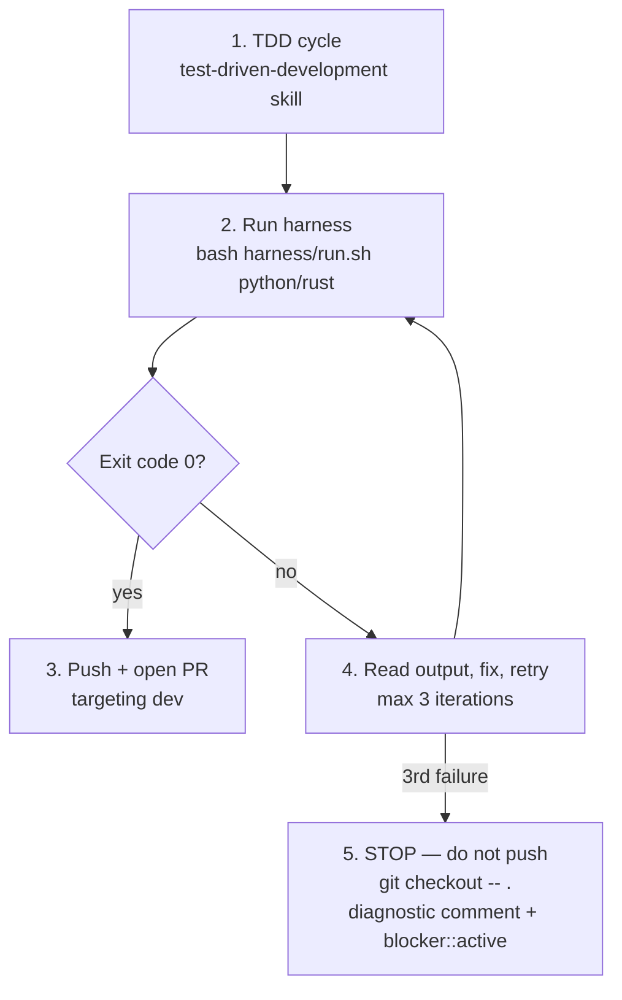

# Harness Engineering (Pre-Push Quality Gate)

## Overview

The harness is the **authoritative pre-push gate**: it runs the project's full
quality-gate suite (lint, format, type-check, tests) inside a hardened container
before anything is pushed or a PR is opened.

**Core principle:** The harness exit code is the gate. Exit `0` → push. Non-zero → fix. Three consecutive failures → stop and escalate.

**KIS:** exit code + stdout/stderr is enough. No XML parsing, no result schemas, no config files.

## When to Use

**Always, before pushing ANY code:**
- New features
- Bug fixes
- Refactoring
- Documentation-only changes that touch validated doc sets (mermaid, links, MADR)

## The 5-Step Pre-Push Gate



### Step 1 — TDD Cycle First

Follow the `test-driven-development` skill: write the failing test (RED), watch it fail,
write minimal passing code (GREEN), refactor. The harness does not replace TDD — it
verifies the result of the cycle.

### Step 2 — Run the Harness

Against the working tree, from the repo root:

```bash
bash harness/run.sh python   # Python projects (uv / pytest stack)
bash harness/run.sh rust     # Rust projects (cargo stack)
```

Phases — `harness/run.sh <python|rust> [deps|gate|all]` (see [harness/run.sh](../../harness/run.sh)):

| Phase | Network | What it does |
| :---- | :------ | :----------- |
| `deps` | ON | Resolve dependencies (`uv sync` / `cargo fetch`) |
| `gate` | OFF | Lint, format, type-check, tests — fail-fast |
| `all`  | both | `deps` then `gate` (default) |

The `gate` phase runs the language-specific pre-flight commands inside the hardened
container — Python: `ruff`, `black`, `isort`, `mypy --strict`, `pytest -W error
--cov-fail-under=80`; Rust: `cargo fmt --check`, `cargo clippy -- -D warnings`,
`cargo test`. Security context (why the gate is trustworthy): read-only root
filesystem, non-root UID 1000, all capabilities dropped, no-new-privileges,
`--network=none` during the gate phase, bounded CPU/memory, no secrets mounted
(see [harness/README.md](../../harness/README.md)).

### Step 3 — Pass → Push + Open PR

Exit code `0` is the gate. Push the branch and open the PR targeting `dev`
(developer agent workflow). **Never push on a red gate.**

### Step 4 — Fail → Read Output, Fix, Retry (max 3)

Read stdout/stderr directly — the failing command and its output are the diagnosis.
Fix the code (never weaken the gate), then re-run the harness. Maximum **3**
self-correction iterations.

### Step 5 — 3 Failures → STOP

On the third consecutive failure:

1. **Stop.** Do not push.
2. `git checkout -- .` — discard the working-tree changes.
3. Post a diagnostic comment on the issue via GitHub MCP with the exact failing
   command and error output.
4. Label the issue `blocker::active` and notify `@architect` and `@scrum-master`.

## Common Rationalizations

| Excuse | Reality |
| :----- | :------ |
| "It's a docs-only change" | Doc sets are validated (mermaid/links/MADR) — run the gate. |
| "The gate is slow" | A red CI run is slower. The harness catches it pre-push. |
| "I'll fix it in CI" | CI red = PR blocked. The gate exists to prevent exactly this. |
| "One more retry won't hurt" | After 3 failures the circuit breaker fires. Stop. |
| "Skip the harness, I ran the linters" | Local runs lack the hardened-container context; the harness exit code is the gate. |

## Verification Checklist

Before pushing:

- [ ] TDD cycle completed before the harness run
- [ ] `bash harness/run.sh python|rust` exited `0`
- [ ] On failure: at most 3 fix-and-retry iterations, each preceded by reading the output
- [ ] On 3rd failure: changes discarded (`git checkout -- .`), diagnostic comment posted, `blocker::active` applied
