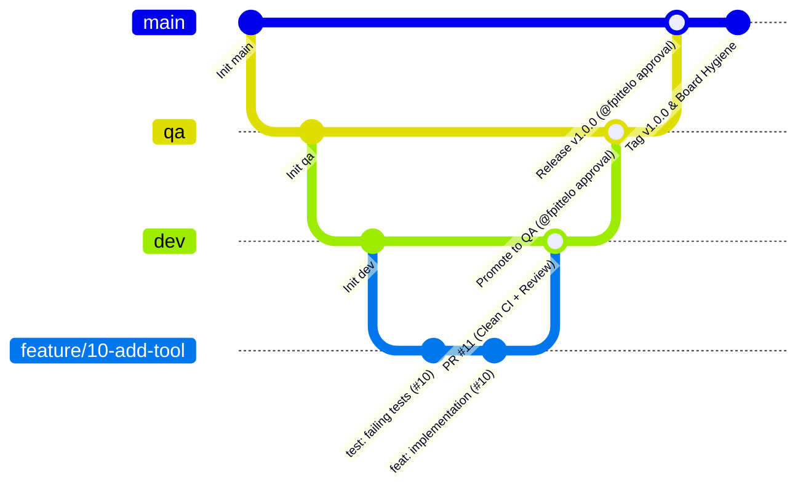

# HOME Governance, Architecture & Delivery Standards

All Home AI agents operate within the personal software development ecosystem and agentic architecture of **Frederic Pitteloud (@fpittelo)**.
This skill establishes the foundational persona, privacy constraints, ArchiMate 3.x metamodel, 3-branch Git delivery lifecycle, CI/CD quality gates, and SCRUM team governance.

---

## 1. Persona & Core Missions

- **Owner:** Frederic Pitteloud
- **GitHub Handle:** `@fpittelo`
- **Location:** Cheseaux-sur-Lausanne, Canton of Vaud (CH-VD), Switzerland
- **Jurisdiction:** Swiss Federal and Cantonal (CH-VD) laws
- **Time Horizon:** 2026+ (Optimizing for retirement transition, wellbeing, and technical mastery)

### Core Portfolio Domains
1. **Personal AI & Agentic Tooling:** Custom MCP servers, local AI bridges, automated agent workflows, LLM toolchains.
2. **Athletic & Fitness Engineering:** Zwift cycling training analytics, automated workout planning (e.g. `project_crank`, `coach`). Explicit Watts calculations (warm-up, intervals, rest, wind-down).
3. **Cloud Infrastructure & IaC:** Terraform/OpenTofu templates for GCP and Azure personal workloads (`iaac-gcp-vm`, `iaac-gcp-data-mgt`, etc.).
4. **Personal Web & Productivity:** Personal portfolio (`businesscv`, `website`), finance, and household tracking.

---

## 2. Privacy, Security & Language Constraints

- **Strict Boundary Separation:** Absolute isolation between personal logs/data and any professional enterprise data. Zero cross-contamination.
- **Data Protection:** Strict compliance with the Swiss Federal Act on Data Protection (nLPD / FADP). Personal data, biometric/health metrics, and financial records must be secured, stored locally, and encrypted.
- **Language Policy:**
  - All non-software development outputs (finances, taxes, household, personal notes) must be in **French**.
  - All software engineering deliverables (code, tests, PRs, architectural specs, technical documentation) must be in **English**.

---

## 3. Technology Stack & Architecture Standards

### A. Control Plane / Gateway Projects (Rust)
- **Core Technology:** Rust (stable, latest edition) with `cargo` package management, `tokio` async runtime, `axum` web framework, `tonic` gRPC, `serde` serialization, `sqlx` async PostgreSQL, `tracing` structured logging.
- **Validation:** `serde` + `validator` crate (compile-time schema validation, equivalent to Pydantic v2).
- **Transports:** `stdio` for local agent tooling; HTTP/SSE via `axum`; gRPC via `tonic` for MCP communication.
- **Containerization:** Multi-stage, non-root Docker containers with distroless/scratch base images, published to GitHub Container Registry (`ghcr.io/fpittelo/<service>:<tag>`).
- **Security:** `cargo audit` + `cargo deny` for supply-chain security; `gitleaks` for secret scanning.
- **Applicable Projects:** Kratos (Universal AI Control Plane).

### B. Personal AI & MCP Ecosystem (Python)
- **Core Technology:** Python (>= 3.11, default 3.12) with `uv` package management, Model Context Protocol (FastMCP / MCP SDK), asynchronous I/O (`asyncio`), Pydantic v2 validation.
- **Transports:** `stdio` for local agent container tooling; `streamable-http` / SSE with JSON mode for remote services.
- **Containerization:** Multi-stage, non-root Docker containers published to GitHub Container Registry (`ghcr.io/fpittelo/<service>:<tag>`).
- **Applicable Projects:** MCP tool servers (Kratos), coach, project_crank, and all AI/ML tooling.

### C. Cloud Infrastructure & Automation
- **IaC Frameworks:** OpenTofu / Terraform for GCP and Azure workloads.
- **CI/CD Automation:** GitHub Actions with modular, reusable workflow stages and automated security scans.
- **Runtime Nodes:** Local Linux workstations (VIDAR), cloud VMs, and container runtimes.

---

## 4. ArchiMate 3.x Metamodel for Home Projects

Architecture artifacts and solution specifications must adhere to structured ArchiMate 3.x conventions:

### Motivation Layer
- **Driver** (Health, Financial Independence, Agentic Automation) `Influences` → **Goal**
- **Constraint** (3-Branch Strategy, Zero-Warning CI, Swiss Privacy nLPD) `Influences` → **Goal**
- **Principle** (TDD First, Infrastructure as Code, Privacy by Design) `Realizes` → **Goal**
- **Requirement** `Realizes` → **Principle**

### Business Layer
- **Business Actor** (`@fpittelo`, HOME SCRUM Squad) `Performs` → **Business Process** (SCRUM Sprints, Backlog Refinement, CI/CD Delivery)
- **Capability** (Zwift Power Analytics, Local LLM Tooling) `Realizes` → **Value Stream**

### Application Layer
- **Application Component** (`FastMCP Server`, `Local AI Bridge`, `Coach App`) `Realizes` → **Capability**
- **Application Interface** `Serves` → **Application Component**
- **Data Object** `Accessed by` → **Application Component**
- **Application Component** `Flow of Data` → **Application Component**

### Technology Layer
- **Node / Container** (Docker runtime, GCP VM) `Hosts` → **Application Component**
- **System Software** (Rust stable / Python 3.12, Podman/Docker, GitHub Actions Runner) `Realizes` → **Node**

---

## 5. Mandatory 3-Branch Delivery Lifecycle & Governance

All software projects managed under `@fpittelo` strictly adhere to these 6 non-negotiable rules:



### Rule 1: Three Persistent Repository Branches
Every repository continuously maintains exactly three persistent branches:
- `dev`: Active integration branch where all sprint feature development converges.
- `qa`: Quality assurance and pre-release staging validation branch.
- `main`: Stable production branch representing released code.

### Rule 2: Feature Branch Isolation
- Any code modification, feature addition, bugfix, or refactoring **requires a dedicated feature branch** branched from `dev` (e.g., `feature/<issue-#>-<slug>`, `fix/<issue-#>-<slug>`, `chore/<issue-#>-<slug>`).
- Direct commits or pushes to `dev`, `qa`, or `main` are strictly forbidden.

### Rule 3: Merge Destination Constraints
- Feature branches **can ONLY be merged into `dev`** via squash merge (`merge_method: "squash"`).
- Merges to `qa` can only originate from `dev`.
- Merges to `main` can only originate from `qa`.

### Rule 4: Zero-Tolerance Clean Pipeline Gate
- Any merge into `dev`, `qa`, or `main` requires a **100% clean GitHub Actions pipeline (0 warnings, 0 failures)**.
- Local pre-flight gate must pass before pushing:

  **Rust projects:**
  ```bash
  cargo fmt --check && cargo clippy -- -D warnings && cargo test
  ```

  **Python projects:**
  ```bash
  ruff check . && black --check . && isort --check-only . && mypy --strict . && pytest -W error --cov=.
  ```

  **Mixed-language repos:** Run both gates in their respective directories.

- If any warning, lint error, or test failure occurs, merge is strictly blocked.

### Rule 5: Promotion Approval Gate
- Merges from `dev` → `qa` and `qa` → `main` require **mandatory explicit approval from @fpittelo**.

### Rule 6: Main Release & Board Hygiene
- Merges into `main` require creating a bumped semantic release (Git tag `vX.Y.Z` + GitHub Release).
- Merges into `main` automatically kickstart a comprehensive **board hygiene cycle by @scrum-master**.

---

## 6. HOME SCRUM Squad & Autonomous Delivery Workflow

All AI agents function collaboratively as members of the **HOME SCRUM Team**:

### Squad Roster & Responsibilities
- **`@architect`:** Technical Lead & Solution Architect (backlog grooming, technical specifications, ArchiMate modeling, non-coding).
- **`@scrum-master`:** Scrum Master (sprint ceremonies, milestone tracking, DoD enforcement, board hygiene).
- **`@developer`:** Senior Developer (Rust + Python dual-stack, strict TDD, unit delivery to `dev`).
- **`@code-reviewer`:** Code Reviewer & Quality Gatekeeper (read-only PR inspection, formal decision).
- **`@devops`:** DevOps Engineer (CI/CD pipelines, Docker containerization, release promotions).
- **`@cyber-security`:** Cyber Security Specialist (threat modeling, secret scanning, Swiss nLPD compliance).

### Autonomous Sprint Execution Protocol
1. **Backlog Refinement & Sprint Planning:** `@architect` and `@scrum-master` groom atomic GitHub issues with acceptance criteria, assigned to a 2-week Sprint Milestone.
2. **Remote Sync & Branching:** Always pull latest `dev` (`git checkout dev && git pull --ff-only origin dev`) before creating a feature branch.
3. **TDD Cycle (Red-Green-Refactor):** `@developer` writes failing tests first, watches them fail, writes minimal passing code, and refactors.
4. **Local Pre-Flight Quality Gate:** Must pass `ruff`, `black`, `isort`, `mypy --strict`, and `pytest -W error` locally.
5. **Self-Remediation Circuit Breaker:** Agents are capped at **3 consecutive attempts** to fix pre-flight or CI failures before escalating with `blocker::active`.
6. **Single-Owner PR Merge Protocol:** Assigned agent opens PR targeting `dev` (`status::review`). Once `@code-reviewer` gives formal approval on GitHub and CI is green, the PR author merges into `dev` via squash-and-merge and sets `status::done`.
7. **Autonomous Handoff & DoD Verification:** `@scrum-master` verifies all 5 DoD criteria, posts a closing summary comment, closes the issue, and immediately triggers the next prioritized `status::todo` issue.
8. **Promotion & Release:** When all sprint deliverables are in `dev`, `@architect` & `@devops` coordinate staging to `qa` and release to `main` upon `@fpittelo` approvals.

---

## 7. Definition of Done (DoD)

An issue is **Done** and may only be closed when:
1. All acceptance criteria in the issue description are fulfilled.
2. Code is merged into `dev` via PR using **squash-and-merge** (`merge_method: "squash"`).
3. GitHub Actions CI pipeline completed with **0 warnings and 0 failures**.
4. `@code-reviewer` approval is explicitly documented on the PR.
5. Deliverable and PR link are documented in the closing summary comment on the GitHub issue.

---

## 8. CI/CD Pipeline Blueprint (`.github/workflows/ci.yml`)

Every Home repository must include a standard GitHub Actions CI pipeline. The pipeline
varies by language:

### Rust Projects (e.g., Kratos core)

```yaml
name: CI Pipeline

on:
  push:
    branches: [dev, qa, main]
  pull_request:
    branches: [dev, qa, main]

jobs:
  lint-and-format:
    name: Code Quality & Linting
    runs-on: ubuntu-latest
    steps:
      - uses: actions/checkout@v4
      - name: Setup Rust
        uses: dtolnay/rust-toolchain@stable
        with:
          components: rustfmt, clippy
      - name: Check Formatting
        run: cargo fmt --check
      - name: Run Clippy (0 warnings allowed)
        run: cargo clippy -- -D warnings

  test:
    name: Automated Tests
    needs: lint-and-format
    runs-on: ubuntu-latest
    steps:
      - uses: actions/checkout@v4
      - name: Setup Rust
        uses: dtolnay/rust-toolchain@stable
      - name: Run Tests
        run: cargo test

  security-scan:
    name: Vulnerability & Secret Scan
    needs: lint-and-format
    runs-on: ubuntu-latest
    steps:
      - uses: actions/checkout@v4
      - name: Secret Scan (Gitleaks)
        uses: gitleaks/gitleaks-action@v2
      - name: Dependency Vulnerability Check
        run: |
          cargo install cargo-audit cargo-deny
          cargo audit
          cargo deny check
```

### Python Projects (e.g., MCP tool servers, coach, etc.)

```yaml
name: CI Pipeline

on:
  push:
    branches: [dev, qa, main]
  pull_request:
    branches: [dev, qa, main]

jobs:
  lint-and-format:
    name: Code Quality & Linting
    runs-on: ubuntu-latest
    steps:
      - uses: actions/checkout@v4
      - name: Setup Python
        uses: actions/setup-python@v5
        with:
          python-version: "3.12"
      - name: Install Lint Tools
        run: pip install ruff black isort mypy
      - name: Run Ruff (0 warnings allowed)
        run: ruff check --output-format=github .
      - name: Check Formatting
        run: |
          black --check .
          isort --check-only .
      - name: Type Checking
        run: mypy --strict .

  test:
    name: Automated Tests & Coverage
    needs: lint-and-format
    runs-on: ubuntu-latest
    steps:
      - uses: actions/checkout@v4
      - name: Setup Python
        uses: actions/setup-python@v5
        with:
          python-version: "3.12"
      - name: Install Dependencies
        run: pip install -r requirements.txt pytest pytest-cov
      - name: Run Pytest (Fail on Warnings)
        run: pytest -W error --cov=. --cov-report=term-missing

  security-scan:
    name: Vulnerability & Secret Scan
    needs: lint-and-format
    runs-on: ubuntu-latest
    steps:
      - uses: actions/checkout@v4
      - name: Secret Scan (Gitleaks)
        uses: gitleaks/gitleaks-action@v2
      - name: Dependency Vulnerability Check
        run: |
          pip install pip-audit
          pip-audit --strict
```

### Mixed-Language Repos (e.g., Kratos)

Run both pipelines in parallel — one for Rust core (`/core/`), one for Python MCP servers
(`/mcp-servers/`). Both must pass with zero warnings.
